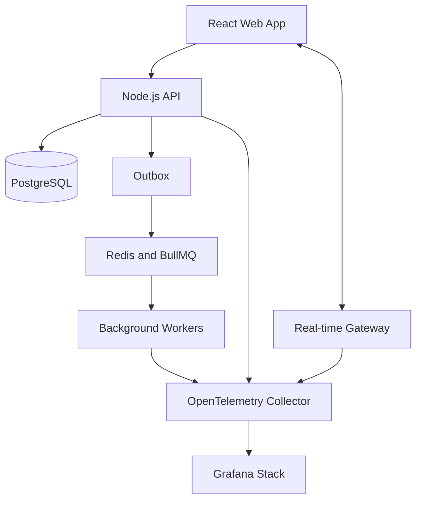

# IncidentLab

## Documentação de arquitetura

- [System design consolidado](./docs/architecture/system-design.md)
- [Base técnica da Fatia 1](./docs/architecture/technical-baseline.md)
- [Modelo conceitual do domínio](./docs/architecture/domain-model.md)
- [Contratos de aplicação](./docs/architecture/application-contracts.md)
- [Casos de uso e critérios de aceite do MVP](./docs/requirements/mvp.md)
- [Roteiro de implementação por fatias verticais](./docs/implementation/roadmap.md)
- [Backlog da Fatia 1 — incidente manual](./docs/implementation/slice-01-backlog.md)
- [Vocabulário do domínio](./CONTEXT.md)
- [Decisões arquiteturais](./docs/adr/README.md)

## Visão geral

O **IncidentLab** é uma plataforma colaborativa para detectar, acompanhar e resolver incidentes em aplicações e serviços.

O sistema monitora sinais previamente configurados, como indisponibilidade, aumento da taxa de erros e lentidão. Quando uma condição de alerta permanece ativa pelo período definido, um incidente é aberto automaticamente e a equipe pode investigá-lo em uma sala colaborativa em tempo real.

O objetivo do projeto não é encontrar bugs diretamente no código. Ele identifica **sintomas de que um sistema está apresentando problemas**.

## Objetivo para o portfólio

Este projeto deve demonstrar conhecimentos além da criação de telas e endpoints, principalmente:

- Arquitetura de software;
- Processamento assíncrono;
- Sistemas orientados a eventos;
- Comunicação em tempo real;
- Concorrência;
- Resiliência a falhas;
- Observabilidade;
- Testes de integração e carga;
- Infraestrutura e CI/CD.

## Exemplo de funcionamento

Uma empresa cadastra sua API de pagamentos e define as seguintes regras:

- Verificar o endpoint `/health` a cada 30 segundos;
- Abrir um incidente após três falhas consecutivas;
- Abrir um incidente se a latência ultrapassar 2 segundos;
- Abrir um incidente se a taxa de erros permanecer acima de 10% durante 1 minuto.

O fluxo seria:

1. O IncidentLab recebe ou coleta dados do serviço monitorado.
2. Os dados são comparados com as regras configuradas.
3. Quando uma condição é atendida, um incidente é criado.
4. A equipe recebe a atualização em tempo real.
5. Os participantes entram na sala do incidente e registram as ações realizadas.
6. O sistema continua monitorando o serviço.
7. Quando os sinais voltam ao normal, o incidente pode ser resolvido.
8. Um relatório pós-incidente é criado com toda a timeline.

### Exemplo de evento recebido

```json
{
  "eventId": "evt_01JABC123",
  "serviceId": "payment-api",
  "status": "unhealthy",
  "latencyMs": 2450,
  "errorRate": 0.18,
  "timestamp": "2026-09-05T21:30:00Z"
}
```

### Exemplo de regra de alerta

```json
{
  "metric": "errorRate",
  "operator": "greater_than",
  "threshold": 0.1,
  "durationSeconds": 60
}
```

Essa regra significa: se a taxa de erros permanecer acima de 10% durante 60 segundos, um incidente deve ser aberto.

## Formas de detectar problemas

### 1. Health checks

O IncidentLab chama periodicamente uma URL do serviço, como `/health`, e verifica:

- Código HTTP retornado;
- Tempo de resposta;
- Quantidade de falhas consecutivas;
- Conteúdo esperado da resposta.

### 2. Eventos enviados pelas aplicações

Outras aplicações enviam métricas ou eventos para um endpoint de ingestão do IncidentLab.

Exemplos:

- Taxa de erros;
- Latência média;
- Quantidade de requisições;
- Falha em uma tarefa importante;
- Indisponibilidade de uma dependência.

### 3. Simulador interno

O projeto terá um serviço de demonstração capaz de simular:

- Respostas lentas;
- Erros HTTP 500;
- Indisponibilidade;
- Oscilação entre estados saudável e indisponível;
- Grande volume de eventos;
- Eventos duplicados.

Isso permitirá demonstrar o projeto sem depender de aplicações externas.

## Funcionalidades principais

### Organizações e usuários

- Cadastro e autenticação;
- Criação de organizações;
- Convite de participantes;
- Papéis e permissões;
- Perfis sugeridos: `admin`, `responder` e `viewer`.

### Serviços monitorados

- Cadastro de serviços;
- Estado atual do serviço;
- Histórico de disponibilidade;
- Configuração de health checks;
- Chave para envio de eventos;
- Regras de alerta configuráveis.

### Incidentes

- Criação manual ou automática;
- Severidades `low`, `medium`, `high` e `critical`;
- Estados `open`, `investigating`, `monitoring` e `resolved`;
- Atribuição de responsáveis;
- Timeline imutável de acontecimentos;
- Relação entre o incidente e a regra que o originou;
- Registro da causa e da solução.

### Colaboração em tempo real

- Sala específica para cada incidente;
- Mensagens em tempo real;
- Indicação de participantes conectados;
- Atualizações instantâneas de estado e responsável;
- Confirmação de recebimento de eventos;
- Recuperação de eventos após uma desconexão temporária;
- Tratamento de alterações concorrentes.

### Página de status

- Estado público dos serviços;
- Incidentes ativos;
- Atualizações publicadas pela equipe;
- Histórico de disponibilidade;
- Página pública opcional por organização.

### Relatório pós-incidente

- Resumo do ocorrido;
- Impacto causado;
- Causa raiz;
- Timeline das ações;
- Tempo até detecção e resolução;
- Ações preventivas;
- Exportação em Markdown ou PDF.

## Conceitos técnicos aplicados

| Conceito | Aplicação no IncidentLab |
| --- | --- |
| WebSockets | Mensagens, presença e atualizações em tempo real |
| Concorrência | Controle de alterações simultâneas no mesmo incidente |
| Idempotência | Impede que eventos repetidos criem incidentes duplicados |
| Transactional Outbox | Salva alterações e eventos de domínio na mesma transação |
| Filas | Executa verificações, notificações e relatórios em segundo plano |
| Retry e backoff | Repete tarefas temporariamente malsucedidas sem sobrecarregar dependências |
| Dead-letter queue | Separa tarefas que excederam o limite de tentativas |
| Logs estruturados | Registra informações pesquisáveis com contexto |
| Métricas | Mede erros, latência, filas e disponibilidade |
| Distributed tracing | Acompanha uma operação entre API, fila e worker |
| Rate limiting | Protege autenticação e ingestão de eventos |
| RBAC | Controla as ações permitidas para cada papel |
| Testes de carga | Avalia o sistema com muitos eventos e conexões simultâneas |
| Chaos testing | Verifica o comportamento durante quedas de componentes |
| Infrastructure as Code | Mantém a infraestrutura versionada e reproduzível |

## Arquitetura inicial

A primeira versão deve utilizar um **monólito modular**, acompanhado de workers separados para tarefas assíncronas. Microsserviços só devem ser introduzidos posteriormente se houver uma justificativa concreta.



### Módulos sugeridos

- `identity`: autenticação, usuários e organizações;
- `services`: serviços monitorados e health checks;
- `alert-rules`: regras e avaliação de métricas;
- `incidents`: ciclo de vida dos incidentes;
- `collaboration`: mensagens, participantes e presença;
- `notifications`: notificações e integrações;
- `status-pages`: páginas públicas de status;
- `postmortems`: relatórios pós-incidente;
- `telemetry`: instrumentação e correlação.

## Stack sugerida

### Front-end

- React;
- TypeScript;
- TanStack Query;
- Zustand;
- Socket.IO Client;
- React Hook Form;
- Zod.

### Back-end

- Node.js;
- TypeScript;
- Fastify ou NestJS;
- Socket.IO;
- PostgreSQL;
- Prisma ou Drizzle ORM;
- Redis;
- BullMQ.

### Observabilidade

- OpenTelemetry;
- Prometheus;
- Grafana;
- Loki;
- Tempo.

### Testes e infraestrutura

- Vitest;
- Playwright;
- Testcontainers;
- k6;
- Docker Compose;
- GitHub Actions;
- Terraform.

## Decisões importantes

### Monólito modular antes de microsserviços

O sistema deve começar em uma única aplicação organizada por módulos. Isso mantém o desenvolvimento viável e ainda permite aplicar limites claros entre domínios.

Como evolução, um módulo pode ser extraído para outro serviço e usado para demonstrar comunicação distribuída, tracing e tolerância a falhas.

### Eventos não garantem exatamente uma entrega

Um evento pode ser entregue novamente após uma falha. Cada evento enviado precisa possuir um `eventId`, armazenado pelo consumidor para impedir o processamento duplicado.

### Incidentes não devem abrir imediatamente por qualquer oscilação

As regras devem aceitar uma duração ou quantidade mínima de ocorrências. Isso evita abrir incidentes por falhas isoladas e reduz falsos positivos.

### Operações importantes precisam ser rastreáveis

Cada requisição e tarefa assíncrona deve carregar um `correlationId`. Com isso, é possível relacionar logs e traces produzidos por diferentes partes do sistema.

## Roadmap

O roteiro vigente, organizado por entregas verticais e sem decisões tecnológicas, está em [Roteiro de implementação](./docs/implementation/roadmap.md). As fases abaixo são o rascunho técnico original da ideia e não definem mais a ordem de execução.

### Fase 1 — Fundação

- Definir requisitos e casos de uso;
- Criar monorepo;
- Preparar banco de dados;
- Configurar autenticação;
- Criar organizações e serviços;
- Criar incidentes manualmente;
- Configurar ambiente com Docker Compose.

### Fase 2 — Tempo real

- Criar sala do incidente;
- Implementar mensagens;
- Mostrar participantes conectados;
- Atualizar estado e responsável em tempo real;
- Tratar desconexões e reconexões;
- Testar alterações concorrentes.

### Fase 3 — Monitoramento

- Implementar health checks;
- Criar endpoint de ingestão;
- Criar regras de alerta;
- Abrir incidentes automaticamente;
- Criar simulador de falhas;
- Aplicar idempotência.

### Fase 4 — Processamento assíncrono

- Adicionar BullMQ e Redis;
- Criar workers;
- Implementar Transactional Outbox;
- Adicionar retry com backoff;
- Criar dead-letter queue;
- Implementar notificações.

### Fase 5 — Observabilidade

- Adicionar logs estruturados;
- Instrumentar API, WebSocket e workers;
- Coletar métricas;
- Implementar distributed tracing;
- Criar dashboards no Grafana;
- Configurar alertas internos do próprio IncidentLab.

### Fase 6 — Qualidade e entrega

- Criar testes de integração;
- Criar testes end-to-end;
- Executar testes de carga;
- Simular indisponibilidade de componentes;
- Criar pipeline de CI/CD;
- Provisionar ambiente com Terraform;
- Publicar a demonstração.

### Fase 7 — Diferenciais

- Criar página pública de status;
- Criar relatório pós-incidente;
- Exportar o relatório;
- Adicionar integrações externas;
- Criar workflow durável para escalação de incidentes;
- Separar um módulo como serviço independente, se houver justificativa.

## Cenários técnicos para demonstrar

### Evento duplicado

O simulador envia o mesmo `eventId` duas vezes. O sistema processa apenas a primeira entrega e registra a segunda como duplicada.

### Worker indisponível

Um evento permanece na fila enquanto o worker está parado. Quando o processo retorna, a tarefa é processada sem perda.

### Falha durante a publicação

A alteração do incidente é salva no banco, mas a publicação do evento falha. O Outbox Worker encontra o evento pendente e tenta publicá-lo novamente.

### Redis indisponível

O sistema mantém as operações síncronas possíveis, registra a degradação e informa que funcionalidades em tempo real ou assíncronas estão temporariamente indisponíveis.

### Desconexão do usuário

O usuário perde a conexão durante um incidente e, ao retornar, recupera os eventos perdidos ou recebe novamente o estado atual.

### Alteração concorrente

Duas pessoas tentam resolver o mesmo incidente. O sistema utiliza versionamento otimista ou uma operação atômica para preservar um estado consistente.

## Testes importantes

- Unidade: avaliação de regras de alerta;
- Unidade: transições permitidas para o estado do incidente;
- Integração: persistência de evento e registro no outbox;
- Integração: consumo idempotente de eventos;
- Integração: retry e dead-letter queue;
- End-to-end: abertura automática e resolução de um incidente;
- End-to-end: desconexão e reconexão da sala;
- Concorrência: alterações simultâneas;
- Carga: ingestão de muitos eventos;
- Resiliência: parada do worker, Redis ou banco.

## Métricas do próprio IncidentLab

- `http_request_duration_seconds`;
- `http_requests_total`;
- `incident_events_received_total`;
- `incident_events_duplicated_total`;
- `incidents_opened_total`;
- `alert_evaluation_duration_seconds`;
- `queue_jobs_waiting`;
- `queue_jobs_failed_total`;
- `websocket_connections_active`;
- `outbox_events_pending`;
- `mean_time_to_detect_seconds`;
- `mean_time_to_resolve_seconds`.

## Estrutura sugerida do repositório

```text
incident-lab/
├── apps/
│   ├── web/
│   ├── api/
│   ├── worker/
│   └── simulator/
├── packages/
│   ├── contracts/
│   ├── database/
│   ├── observability/
│   └── shared/
├── infrastructure/
│   ├── docker/
│   ├── grafana/
│   ├── prometheus/
│   └── terraform/
├── docs/
│   ├── architecture/
│   ├── decisions/
│   └── diagrams/
└── tests/
    ├── integration/
    ├── load/
    └── resilience/
```

## Como apresentar no portfólio

O repositório deve incluir:

- README com uma explicação objetiva do problema;
- GIF ou vídeo curto mostrando um incidente completo;
- Diagrama da arquitetura;
- Instruções para executar localmente;
- Dados de demonstração;
- Dashboards do Grafana;
- Decisões arquiteturais registradas em ADRs;
- Cenários de falha e comportamento esperado;
- Resultados dos testes de carga;
- Seção `Trade-offs and limitations`;
- Roadmap com funcionalidades concluídas e futuras.

### Demonstração sugerida

1. Iniciar todos os componentes com Docker Compose.
2. Abrir o dashboard e mostrar os serviços saudáveis.
3. Ativar latência ou erros no simulador.
4. Acompanhar a regra sendo violada.
5. Observar a abertura automática do incidente.
6. Entrar na sala com dois usuários.
7. Alterar estado, responsável e publicar atualizações.
8. Mostrar logs, métricas e traces relacionados.
9. Normalizar o serviço.
10. Resolver o incidente e gerar o relatório final.

## Limites da primeira versão

Para manter o projeto executável, a primeira versão não precisa incluir:

- Kubernetes;
- Vários microsserviços;
- Aplicativo mobile;
- Integração com dezenas de provedores;
- Detecção inteligente com IA;
- Monitoramento completo de infraestrutura;
- Sistema complexo de cobrança.

Esses itens podem aumentar bastante o tamanho do projeto sem melhorar proporcionalmente a demonstração dos conceitos principais.

## Resultado esperado

Ao final, o IncidentLab deve permitir que uma pessoa provoque uma falha em um serviço de demonstração, veja o sistema detectar o problema, acompanhe a criação automática de um incidente e participe da resolução em tempo real.

O diferencial do projeto estará em mostrar claramente como o sistema lida com eventos duplicados, tarefas assíncronas, desconexões, concorrência e falhas de infraestrutura, além de permitir que todo o fluxo seja observado por logs, métricas e traces.
