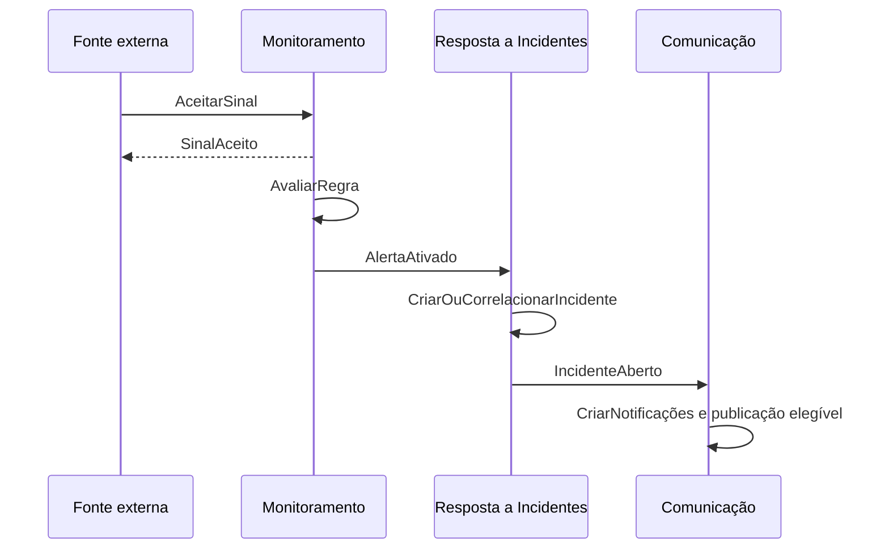

# Contratos de aplicação do IncidentLab

Status: aceito

Este documento define as intenções e os fatos trocados no fluxo de aplicação, sem escolher protocolo, serialização, broker, framework ou formato físico. Ele parte do [modelo conceitual](./domain-model.md), do [system design](./system-design.md) e dos [critérios do MVP](../requirements/mvp.md).

## Convenções

### Comando

Expressa uma intenção que pode ser aceita ou recusada. Todo comando identifica:

- sua própria identidade idempotente;
- organização e ator ou origem autenticada;
- instante da solicitação;
- entidade alvo, quando existir;
- versão observada, quando substituir estado concorrente;
- correlação do fluxo e causa imediata, quando houver.

Resultados conceituais comuns:

| Resultado | Significado |
| --- | --- |
| Aceito | A intenção foi confirmada de forma durável |
| Inválido | Dados ou combinação não satisfazem o contrato |
| Não autorizado | A identidade não pode executar a intenção |
| Não encontrado | A entidade não existe no escopo autenticado |
| Conflito | A intenção disputa identidade ou versão já utilizada |
| Limite excedido | A entrada não foi aceita e pode ser repetida depois |
| Indisponível | Não foi possível confirmar a escrita com segurança |

### Acontecimento

Expressa um fato passado que o produtor já confirmou e não pode mais recusar. Todo acontecimento identifica:

- identidade própria;
- nome e versão do contrato;
- organização;
- entidade de origem e sua posição de ordem;
- instante em que o fato ocorreu;
- correlação do fluxo;
- comando ou acontecimento que o causou;
- dados mínimos para o consumidor tomar sua decisão.

A entrega ocorre pelo menos uma vez. Cada consumidor registra `consumidor + identidade do acontecimento`, ignora repetições já concluídas e preserva a ordem da entidade de origem.

## MembroRemovido

| Aspecto | Contrato |
| --- | --- |
| Fato | Um vínculo organizacional deixou de existir |
| Produtor | Organizações |
| Consumidores | Resposta a Incidentes, Comunicação e distribuição em tempo real |
| Entidade de ordem | Vínculo organizacional |
| Identidade causal | Remoção confirmada do vínculo |

Dados mínimos:

- organização, vínculo e usuário;
- instante da remoção;
- referência histórica do autor da ação;
- versão terminal do vínculo;
- correlação e causa.

O acontecimento não enumera incidentes, responsabilidades, conexões, notificações ou entregas. Cada consumidor localiza os efeitos que controla:

- Resposta a Incidentes libera todas as responsabilidades principais vigentes daquele membro, registrando timeline, atualização da sala e `ResponsavelPrincipalAlterado` para cada incidente afetado.
- Comunicação cancela entregas externas ainda não enviadas; notificações e resultados históricos permanecem preservados.
- A distribuição em tempo real encerra as conexões daquele vínculo.

Organizações revoga o acesso ao confirmar a remoção e não espera essas reações. Uma falha em um consumidor não restaura o vínculo nem bloqueia os demais; cada reação é repetida com a mesma identidade e produz no máximo um efeito por entidade afetada.

## PapelDoMembroAlterado

| Aspecto | Contrato |
| --- | --- |
| Fato | O papel de um vínculo organizacional mudou |
| Produtor | Organizações |
| Consumidores | Resposta a Incidentes, Comunicação e distribuição em tempo real |
| Entidade de ordem | Vínculo organizacional |
| Identidade causal | Alteração confirmada do papel |

Dados mínimos:

- organização, vínculo e usuário;
- papel anterior e papel atual;
- instante da alteração;
- referência histórica do autor da ação;
- nova versão do vínculo;
- correlação e causa.

Organizações aplica o novo papel às autorizações assim que confirma a mudança. O acontecimento não transporta uma matriz de permissões nem enumera efeitos em outras áreas.

Reações:

- Resposta a Incidentes libera responsabilidades principais quando o novo papel não permite operar incidentes, registrando um `ResponsavelPrincipalAlterado` por incidente afetado.
- Comunicação cancela entregas externas pendentes cuja audiência não inclua mais o novo papel; notificações e resultados já confirmados permanecem.
- A distribuição em tempo real mantém a conexão quando o vínculo continua ativo, mas passa a permitir somente ações autorizadas pelo papel atual.
- Uma promoção afeta ações e audiências futuras; não atribui incidentes nem recria notificações e entregas anteriores.

Cada consumidor reage de forma idempotente. Uma falha nessa limpeza não reverte a mudança do papel, e toda nova ação é avaliada conforme o vínculo vigente em Organizações.

## Fluxo automático central



## AceitarSinal

| Aspecto | Contrato |
| --- | --- |
| Intenção | Entregar uma observação externa para monitoramento |
| Origem | Fonte externa autenticada |
| Proprietário | Monitoramento |
| Identidade idempotente | `fonte + identificador da origem` |
| Ordem posterior | Avaliação serial por `serviço + regra` |

Dados conceituais de entrada:

- identificador atribuído pela origem;
- instante observado;
- uma ou mais medições conhecidas com seus contextos obrigatórios.

Fonte, serviço e organização são determinados pela credencial. A origem não escolhe essas identidades no conteúdo.

Pré-condições:

- a fonte está ativa e autorizada;
- o instante observado satisfaz a tolerância temporal;
- todas as medições são válidas;
- fonte e organização ainda possuem capacidade de ingestão.

Resultados específicos:

| Resultado | Consequência |
| --- | --- |
| Sinal aceito | Sinal, medições e obrigação de alcançar um desfecho de processamento são confirmados juntos |
| Repetição idêntica | O resultado anterior é devolvido sem nova avaliação |
| Identidade com outro conteúdo | Conflito; o sinal original prevalece |
| Sinal inválido | Todo o sinal é recusado e a identidade pode ser reutilizada após correção |
| Limite excedido | Nada é aceito; a origem pode repetir a mesma identidade depois |
| Escrita indisponível | Nada é confirmado; a origem deve tentar novamente |

## AvaliarRegra

É uma operação interna de Monitoramento, não um contrato entre áreas.

- Consome todo sinal aceito que ainda não alcançou um desfecho de processamento.
- Se o serviço foi arquivado antes da avaliação, registra o sinal como não avaliado por arquivamento sem alterar a avaliação ou criar alerta.
- Processa sequencialmente cada combinação `serviço + regra`.
- Confirma estado da avaliação, ocorrência, evidências e eventual acontecimento juntos.
- Sinal atrasado permanece auditável sem alterar o estado corrente.
- Repetição do mesmo sinal não produz uma segunda alteração na mesma avaliação.
- Restaurar o serviço não recoloca sinais encerrados pelo arquivamento na avaliação.

## AlertaAtivado

| Aspecto | Contrato |
| --- | --- |
| Fato | Uma ocorrência atingiu a condição de ativação |
| Produtor | Monitoramento |
| Consumidor principal | Resposta a Incidentes |
| Entidade de ordem | Avaliação da regra |
| Identidade causal | Ocorrência de alerta ativada |

Dados mínimos:

- organização e serviço;
- ocorrência do alerta e instante original da ativação;
- regra e versão que confirmaram a condição;
- severidade inicial e impacto operacional definidos pela versão;
- resumo das evidências de ativação;
- indicação da regra sobre publicação automática;
- identidades de correlação e causa.

O acontecimento não transporta toda a telemetria nem concede a Resposta a Incidentes permissão para alterar a regra ou o alerta.

## CriarOuCorrelacionarIncidente

É a decisão idempotente tomada por Resposta a Incidentes ao consumir `AlertaAtivado`.

```text
existe incidente automático não resolvido para serviço + regra?
├── sim: anexar a ativação e sua evidência à timeline existente
└── não: criar um novo incidente automático
```

Invariantes:

- a mesma ativação produz no máximo um efeito;
- incidente manual nunca é reutilizado;
- incidente anterior resolvido nunca é reaberto;
- o novo incidente copia regra, versão, severidade inicial e evidências necessárias;
- a obrigação continua válida mesmo se a recuperação chegar antes do processamento.
- uma obrigação confirmada impede o arquivamento do serviço até que o incidente seja criado e resolvido.

## AbrirIncidenteManual

| Aspecto | Contrato |
| --- | --- |
| Intenção | Iniciar uma resposta humana para um problema não originado por alerta |
| Origem | `respondente` ou `admin` autenticado |
| Proprietário | Resposta a Incidentes |
| Identidade idempotente | Identificador do comando no escopo do autor |
| Coordenação | Decisão exclusiva por serviço junto com `ArquivarServico` |

Dados conceituais de entrada:

- serviço;
- severidade inicial;
- impacto operacional declarado, inclusive nenhuma contribuição.

Validações:

- o serviço existe, pertence à organização autenticada e está ativo no cadastro oficial de Monitoramento;
- o autor possui permissão vigente para operar incidentes;
- severidade e impacto pertencem aos valores aceitos pelo domínio.

Resultados específicos:

| Resultado | Consequência |
| --- | --- |
| Incidente aberto | Incidente manual começa `aberto`, privado e sem responsável obrigatório |
| Repetição idêntica | O incidente e o resultado anteriores são devolvidos |
| Serviço inválido ou arquivado | Nenhum incidente é criado |
| Cadastro indisponível | Nada é confirmado; o comando pode ser repetido |
| Arquivamento concorrente | Prevalece a primeira decisão confirmada na ordem do serviço |

A criação confirma juntos o incidente, sua primeira timeline, a atualização inicial da sala e `IncidenteAberto`. Quando o impacto declarado contribui para o estado operacional, também confirma a obrigação de publicar `ImpactoOperacionalDeclarado`.

## CoordenarArquivamentoDoServico

`ArquivarServico`, pertencente a Monitoramento, participa da mesma ordem por serviço usada na abertura manual. Antes de arquivar, verifica se existe incidente não resolvido ou obrigação confirmada de criar um incidente automático para aquele serviço.

- Se a abertura for confirmada primeiro, o arquivamento encontra o incidente ativo e é recusado.
- Se uma ativação já confirmou a obrigação de criar um incidente, o arquivamento aguarda seu processamento e permanece proibido até a resolução desse incidente.
- Se o arquivamento for confirmado primeiro, a abertura posterior encontra o serviço arquivado e é recusada.
- Se a consulta oficial necessária falhar, nenhuma das decisões dependentes é presumida segura.
- Cada comando escreve somente nos dados de sua área proprietária; a coordenação não cria uma transação entre áreas.

## IncidenteAberto

| Aspecto | Contrato |
| --- | --- |
| Fato | Um incidente foi confirmado como aberto |
| Produtor | Resposta a Incidentes |
| Consumidores | Comunicação e distribuição em tempo real |
| Entidade de ordem | Incidente |

Dados mínimos:

- organização, incidente e serviço;
- origem manual ou automática;
- estado e versão do incidente;
- severidade vigente;
- instante de abertura;
- regra e ocorrência de origem, quando automático;
- solicitação de publicação automática copiada da regra, quando aplicável;
- correlação e causa.

Conversa, timeline completa, responsável, destinatários e evidências técnicas não fazem parte desse acontecimento.

## Mudanças específicas do incidente

Resposta a Incidentes publica um fato próprio para cada tipo de mudança relevante entre áreas:

| Acontecimento | Fato |
| --- | --- |
| `EstadoDoIncidenteAlterado` | O incidente passou entre estados não terminais permitidos |
| `SeveridadeDoIncidenteAlterada` | A classificação de severidade vigente mudou |
| `ResponsavelPrincipalAlterado` | O responsável foi atribuído, transferido, substituído ou removido |

Propriedades comuns:

| Aspecto | Contrato |
| --- | --- |
| Produtor | Resposta a Incidentes |
| Consumidores | Comunicação e distribuição em tempo real |
| Entidade de ordem | Incidente |
| Identidade causal | Mudança confirmada do incidente |

Dados comuns mínimos:

- organização, incidente e serviço;
- valor anterior e valor atual do aspecto alterado;
- instante original da mudança;
- referência histórica do autor;
- nova versão do incidente;
- correlação e causa.

Regras específicas:

- `EstadoDoIncidenteAlterado` não representa a transição terminal; a resolução produz `IncidenteResolvido`.
- Uma transição rotineira entre investigação e monitoramento pode atualizar uma publicação existente, mas não cria notificação geral.
- `SeveridadeDoIncidenteAlterada` permite a Comunicação criar apenas as novas entregas exigidas por uma escalada; redução de severidade não apaga entregas já confirmadas.
- `ResponsavelPrincipalAlterado` informa o tipo da mudança e as identidades anterior e atual; quando existe um novo responsável, somente ele recebe a notificação direta.
- Remover a responsabilidade sem designar outra pessoa não cria notificação direta.
- Alterações de impacto operacional usam os acontecimentos próprios destinados a Monitoramento.
- Mensagens, presença e demais mudanças exclusivas da sala não produzem esses acontecimentos entre áreas.

Cada mudança é confirmada junto com a nova versão, a timeline, a atualização da sala e a obrigação de publicar o acontecimento correspondente. Repetições preservam a mesma identidade e não geram efeitos adicionais.

## AtualizacaoDaSala

É o registro incremental e ordenado de uma operação durável que clientes autorizados precisam observar na sala de um incidente. Não é um acontecimento entre áreas nem um canal de notificação.

Identidade e ordem:

| Aspecto | Contrato |
| --- | --- |
| Identidade | Incidente + sequência |
| Ordem | Monotônica e sem duas atualizações na mesma posição |
| Escopo de acesso | Organização e incidente da sala |

Dados mínimos:

- organização, incidente e sequência;
- tipo da mudança;
- instante em que a operação foi confirmada;
- referência histórica do autor, quando aplicável;
- dados incrementais necessários para aplicar a mudança;
- versão atual do incidente, quando a operação a alterar.

Regras:

- Cada operação confirmada ocupa exatamente uma nova posição na sequência da sala.
- Efeitos que precisam permanecer consistentes, como estado e entrada obrigatória de timeline, integram a mesma atualização.
- Mensagens simultâneas recebem posições diferentes sem disputar a versão do incidente.
- A atualização não repete o estado completo da sala.
- Presença não participa da sequência porque é efêmera.
- Distribuição em tempo real e consulta posterior entregam o mesmo registro durável.
- Receber novamente a mesma sequência não reaplica a mudança no cliente.
- O acesso é revalidado antes de conectar, distribuir ou recuperar conteúdo protegido.

## RecuperarSala

| Aspecto | Contrato |
| --- | --- |
| Intenção | Retomar uma sala a partir da última posição conhecida pelo cliente |
| Origem | Membro autenticado com acesso vigente ao incidente |
| Proprietário | Resposta a Incidentes |

Entrada conceitual:

- organização e incidente;
- última sequência aplicada pelo cliente.

Resultados:

| Resultado | Conteúdo |
| --- | --- |
| Intervalo disponível | Todas as atualizações posteriores, em ordem crescente |
| Intervalo indisponível ou posição incompatível | Estado oficial completo autorizado e sequência corrente |
| Sem mudanças | Sequência corrente confirmada, sem atualizações |
| Sem acesso | Nenhum conteúdo da sala é revelado |

O estado completo reúne o incidente vigente, timeline, conversa ainda retida e sequência corrente. Ele substitui a visão local do cliente; atualizações seguintes continuam da posição informada. Presença atual, quando exibida, é obtida separadamente e não integra esse retrato durável.

## EnviarMensagem

| Aspecto | Contrato |
| --- | --- |
| Intenção | Acrescentar conteúdo à conversa de um incidente |
| Origem | `respondente` ou `admin` autenticado |
| Proprietário | Resposta a Incidentes |
| Identidade idempotente | Identificador do comando no escopo do autor e da sala |
| Concorrência | Aditiva; não exige nem altera a versão do incidente |

Dados conceituais de entrada:

- incidente;
- conteúdo da mensagem.

Pré-condições:

- vínculo e permissão continuam vigentes;
- a conversa aceita escrita: incidente não resolvido ou dentro dos sete dias posteriores à resolução;
- o conteúdo satisfaz as regras de entrada do produto.

Resultados:

| Resultado | Consequência |
| --- | --- |
| Mensagem enviada | Mensagem imutável e `AtualizacaoDaSala` são confirmadas juntas |
| Repetição idêntica | A mensagem e a sequência anteriores são devolvidas |
| Identidade com outro conteúdo | Conflito; a mensagem original prevalece |
| Conversa encerrada | Nada é confirmado |
| Sem acesso | Nenhum conteúdo da sala é revelado |

Uma mensagem não altera estado, versão, responsabilidade ou timeline e não cria notificação geral. Correções são novas mensagens com novas identidades.

## PromoverMensagem

| Aspecto | Contrato |
| --- | --- |
| Intenção | Transformar o conteúdo relevante de uma mensagem em nota oficial da timeline |
| Origem | `respondente` ou `admin` autenticado |
| Proprietário | Resposta a Incidentes |
| Identidade idempotente | Identificador do comando no escopo do autor e da sala |
| Unicidade do efeito | No máximo uma entrada promovida por mensagem de origem |
| Concorrência | Aditiva; não exige nem altera a versão do incidente |

Dados conceituais de entrada:

- incidente;
- mensagem de origem.

Pré-condições:

- a mensagem pertence à conversa do mesmo incidente e seu conteúdo está disponível;
- a mensagem não está ocultada no momento da promoção;
- a conversa ainda aceita promoções segundo a janela posterior à resolução;
- o autor possui permissão vigente.

Se a mensagem ainda não foi promovida, a confirmação cria, na mesma operação, uma entrada imutável da timeline e uma `AtualizacaoDaSala`. A entrada copia:

- conteúdo disponível naquele instante;
- identidade histórica e instante da mensagem original;
- identidade histórica de quem promoveu e instante da promoção;
- referência à mensagem de origem.

A cópia passa a ter ciclo e retenção próprios. Ocultar ou remover posteriormente o conteúdo da mensagem original não altera a timeline; uma intervenção na nota oficial exige a moderação própria da timeline.

Regras de repetição e concorrência:

- Repetir o mesmo comando devolve a promoção anterior.
- Outro comando para uma mensagem já promovida devolve a entrada existente, sem criar uma segunda nota.
- Se duas promoções da mesma mensagem concorrerem, somente uma cria a entrada e ocupa uma posição na sequência.
- Correção ou complemento exige uma nova mensagem, que poderá originar sua própria promoção.

## OcultarMensagem

| Aspecto | Contrato |
| --- | --- |
| Intenção | Interromper a exibição de conteúdo sensível na conversa sem apagar seu registro |
| Origem | `admin` autenticado |
| Proprietário | Resposta a Incidentes |
| Identidade idempotente | Identificador do comando no escopo do autor e da sala |
| Concorrência | Não exige nem altera a versão do incidente |

Dados conceituais de entrada:

- incidente e mensagem;
- motivo obrigatório da moderação.

Se a mensagem pertence à sala e ainda não está ocultada, a confirmação registra juntos a ocultação, a autoria administrativa, o motivo, o instante e uma `AtualizacaoDaSala`. A conversa passa a exibir uma indicação de conteúdo ocultado em vez do conteúdo original.

- A mensagem não é editada nem apagada.
- A moderação pode ocorrer mesmo depois do encerramento da conversa.
- Uma entrada da timeline promovida anteriormente não é alterada.
- Repetir o comando devolve seu resultado original; tentar ocultar uma mensagem que já está ocultada devolve a intervenção vigente sem criar outro efeito.
- Depois de uma restauração, uma nova ocultação cria outra intervenção auditável.
- A operação não cria notificação nem acontecimento entre áreas.

## RestaurarExibicaoDaMensagem

| Aspecto | Contrato |
| --- | --- |
| Intenção | Voltar a exibir uma mensagem ocultada por engano ou cujo motivo de restrição deixou de existir |
| Origem | `admin` autenticado |
| Proprietário | Resposta a Incidentes |
| Identidade idempotente | Identificador do comando no escopo do autor e da sala |
| Concorrência | Não exige nem altera a versão do incidente |

Dados conceituais de entrada:

- incidente e mensagem ocultada;
- motivo obrigatório da restauração.

Se a mensagem pertence à sala, está ocultada e seu conteúdo continua disponível, a confirmação registra juntos a restauração, a autoria administrativa, o motivo, o instante e uma `AtualizacaoDaSala`. A conversa volta a apresentar o conteúdo original.

- A ocultação anterior e todas as intervenções permanecem no histórico de auditoria.
- A restauração pode ocorrer mesmo depois do encerramento da conversa.
- A entrada da timeline eventualmente originada pela mensagem permanece independente.
- Repetir o comando devolve seu resultado original; tentar restaurar uma mensagem já visível devolve a restauração vigente sem criar outro efeito.
- Se o conteúdo não estiver mais disponível por retenção ou exclusão administrativa, a restauração é recusada sem alteração parcial.
- A operação não cria notificação nem acontecimento entre áreas.

## OcultarEntradaDaTimeline

| Aspecto | Contrato |
| --- | --- |
| Intenção | Interromper a exibição de conteúdo sensível em uma entrada oficial sem reescrever a timeline |
| Origem | `admin` autenticado |
| Proprietário | Resposta a Incidentes |
| Identidade idempotente | Identificador do comando no escopo do autor e da sala |
| Concorrência | Não exige nem altera a versão do incidente |

Dados conceituais de entrada:

- incidente e entrada da timeline;
- motivo obrigatório da moderação.

A confirmação preserva a entrada em sua posição original e acrescenta a moderação auditável com administrador, motivo e instante. A mesma operação cria uma `AtualizacaoDaSala`, e as consultas passam a apresentar uma indicação de conteúdo ocultado.

- A mensagem que eventualmente originou a entrada permanece independente e não é ocultada automaticamente.
- A correção factual continua sendo feita por uma nova entrada que referencia a anterior.
- Repetir o comando devolve seu resultado original; tentar ocultar uma entrada que já está ocultada devolve a intervenção vigente sem criar outro efeito.
- Depois de uma restauração, uma nova ocultação cria outra intervenção auditável.
- Estado, severidade, responsabilidade e demais fatos do incidente não são revertidos pela ocultação de sua apresentação na timeline.

## RestaurarExibicaoDaEntradaDaTimeline

| Aspecto | Contrato |
| --- | --- |
| Intenção | Voltar a exibir o conteúdo de uma entrada oficial anteriormente ocultada |
| Origem | `admin` autenticado |
| Proprietário | Resposta a Incidentes |
| Identidade idempotente | Identificador do comando no escopo do autor e da sala |
| Concorrência | Não exige nem altera a versão do incidente |

Dados conceituais de entrada:

- incidente e entrada da timeline ocultada;
- motivo obrigatório da restauração.

Se a entrada pertence à timeline, está ocultada e seu conteúdo continua disponível, a confirmação acrescenta uma restauração auditável com administrador, motivo e instante. A mesma operação cria uma `AtualizacaoDaSala`, e as consultas voltam a apresentar o conteúdo original em sua posição.

- A ocultação anterior e todas as intervenções permanecem no histórico de auditoria.
- A mensagem que eventualmente originou a entrada permanece independente.
- Repetir o comando devolve seu resultado original; tentar restaurar uma entrada já visível devolve a restauração vigente sem criar outro efeito.
- Se o conteúdo não estiver mais disponível por retenção ou exclusão administrativa, a restauração é recusada sem alteração parcial.
- Restaurar a apresentação não altera estado, severidade, responsabilidade nem outro fato operacional do incidente.
- A operação não cria notificação nem acontecimento entre áreas.

## ConsultarConteudoModerado

| Aspecto | Contrato |
| --- | --- |
| Intenção | Permitir que um administrador examine conteúdo ocultado em uma visão explícita de auditoria |
| Origem | `admin` autenticado com permissão vigente |
| Proprietário | Resposta a Incidentes |
| Identidade idempotente | Identificador da solicitação no escopo do administrador e da organização |
| Consistência | O acesso auditável é confirmado antes da revelação do conteúdo |

Dados conceituais de entrada:

- incidente;
- tipo e identidade da mensagem ou entrada da timeline ocultada.

Se o alvo pertence ao incidente, está ocultado e seu conteúdo continua disponível, a operação registra a identidade do administrador, o alvo e o instante antes de devolver o conteúdo original e o contexto das intervenções de moderação.

- Consultas normais, retratos e atualizações da sala apresentam somente a indicação de conteúdo ocultado, inclusive para `admins`.
- O conteúdo ocultado não é incluído em busca comum, notificações, projeções públicas nem exportações operacionais.
- Uma nova consulta explícita cria um novo registro de acesso; repetir a mesma solicitação devolve o resultado anterior sem duplicar esse registro.
- Se a permissão não estiver vigente, o alvo não estiver ocultado ou o conteúdo não estiver mais disponível, nenhum conteúdo é revelado.
- Se o registro de auditoria não puder ser confirmado, nenhum conteúdo é revelado.
- A consulta não altera a sequência da sala, o incidente ou as intervenções existentes e não cria notificação nem acontecimento entre áreas.

## ConsultarHistoricoDeModeracao

| Aspecto | Contrato |
| --- | --- |
| Intenção | Examinar as intervenções e os acessos administrativos relacionados à moderação |
| Origem | `admin` autenticado com permissão vigente |
| Proprietário | Resposta a Incidentes |
| Consistência | Consulta somente leitura, sem alterar o incidente ou a sala |

Dados conceituais de entrada:

- incidente;
- mensagem ou entrada da timeline, quando a consulta for específica.

A consulta devolve em ordem as ocultações, restaurações e consultas administrativas aplicáveis, incluindo identidades, motivos e instantes registrados.

- Somente `admins` podem consultar o histórico completo e seus motivos.
- `Respondentes` e `visualizadores` recebem apenas o estado atual de apresentação: conteúdo visível ou indicação de conteúdo ocultado.
- O histórico não inclui o conteúdo original ocultado; sua revelação continua sujeita a `ConsultarConteudoModerado` e ao registro prévio do acesso.
- Consultar o histórico não cria `AtualizacaoDaSala`, notificação ou acontecimento entre áreas.

## ResolverIncidente

| Aspecto | Contrato |
| --- | --- |
| Intenção | Encerrar de forma terminal o trabalho operacional de um incidente |
| Origem | `respondente` ou `admin` autenticado |
| Proprietário | Resposta a Incidentes |
| Entidade alvo | Incidente |
| Concorrência | Exige a versão observada |

Dados conceituais de entrada:

- incidente e versão observada;
- resultado da resolução;
- nota interna obrigatória;
- incidente principal, quando o resultado for `duplicado`;
- confirmação explícita, quando o alerta de origem ainda estiver ativo;
- decisão sobre uma publicação existente, quando ela não puder ser encerrada automaticamente com segurança.

Resultados específicos:

| Resultado | Consequência |
| --- | --- |
| Resolvido | Estado terminal, versão, timeline, atualização da sala e acontecimentos aplicáveis são confirmados juntos |
| Versão antiga | Conflito; nada é alterado e o estado atual é devolvido |
| Resultado inválido | A resolução é recusada sem efeitos parciais |
| Alerta ativo sem confirmação | A resolução é recusada com aviso explícito |
| Publicação ambígua | A resolução aguarda uma escolha segura sobre manter ou encerrar a publicação |

Resolver um incidente manual com impacto vigente também produz `ImpactoOperacionalEncerrado`. Resolver como `duplicado` preserva os dois históricos e apenas registra a referência ao incidente principal.

## IncidenteResolvido

| Aspecto | Contrato |
| --- | --- |
| Fato | Um incidente atingiu seu estado terminal |
| Produtor | Resposta a Incidentes |
| Consumidores | Comunicação e distribuição em tempo real |
| Entidade de ordem | Incidente |
| Identidade causal | Resolução confirmada do incidente |

Dados mínimos:

- organização, incidente e serviço;
- origem manual ou automática;
- severidade final;
- resultado da resolução;
- incidente principal, quando o resultado for `duplicado`;
- instante da resolução e referência histórica do autor;
- indicação de que o alerta de origem ainda estava ativo, quando aplicável;
- decisão explícita sobre uma publicação que não possa afirmar recuperação automaticamente;
- versão terminal do incidente;
- correlação e causa.

A nota interna de resolução não faz parte do acontecimento. Ela permanece em Resposta a Incidentes e chega aos clientes autorizados pela atualização protegida da sala, não pelo contrato entre áreas.

Ao consumir o fato, Comunicação:

- notifica os destinatários das comunicações anteriores de abertura ou escalada;
- produz texto seguro próprio para notificações e para eventual publicação;
- não afirma recuperação quando o alerta continua ativo;
- aplica a decisão humana de manter ou encerrar uma publicação ambígua;
- ignora repetições depois de concluir cada efeito idempotente.

## PublicacaoAlterada

| Aspecto | Contrato |
| --- | --- |
| Fato | A representação autorizada de um incidente público foi criada ou mudou |
| Produtor | Comunicação |
| Consumidor | Página pública |
| Entidade de ordem | Incidente público |
| Identidade causal | Versão confirmada da publicação |

O acontecimento transporta uma substituição completa, não instruções parciais. Seus dados mínimos são:

- identificadores públicos da página, do serviço e do incidente;
- versão da publicação;
- nome público do serviço;
- estado e impacto públicos vigentes;
- instante público de início e eventual encerramento;
- histórico completo de atualizações públicas, em sua ordem confirmada;
- instante da última atualização da projeção.

Somente conteúdo deliberadamente público pode integrar esse contrato. Ele não contém identidades internas, conversa, timeline, responsáveis, nota de resolução, evidências técnicas, hipóteses nem postmortem interno.

Regras de produção:

- Comunicação confirma juntos o incidente público, sua atualização, a nova versão e a obrigação de publicar o acontecimento.
- Uma mudança interna sem efeito autorizado na publicação não produz `PublicacaoAlterada`.
- Encerrar a publicação produz uma nova representação terminal; não remove silenciosamente o histórico público.
- Alterar um postmortem interno não muda essa representação até que uma nova cópia pública seja confirmada explicitamente.

Regras de consumo:

- A página substitui a representação do incidente quando recebe uma versão mais nova.
- A mesma versão é idempotente, e uma versão anterior é ignorada.
- Como cada versão é completa, a versão mais recente pode reparar uma lacuna sem reproduzir versões intermediárias.
- Falha na página não desfaz a publicação já confirmada; o processamento é repetido com a mesma identidade.
- A página nunca consulta Resposta a Incidentes, Monitoramento ou os registros internos de Comunicação.

## AlertaRecuperado

| Aspecto | Contrato |
| --- | --- |
| Fato | Uma ocorrência anteriormente ativa satisfez sua condição de recuperação |
| Produtor | Monitoramento |
| Consumidor principal | Resposta a Incidentes |
| Entidade de ordem | Avaliação da regra |
| Identidade causal | Transição de recuperação da ocorrência de alerta |

Dados mínimos:

- organização e serviço;
- ocorrência do alerta;
- regra e versão usadas na avaliação;
- instantes originais de ativação e recuperação;
- resumo das evidências que confirmaram a recuperação;
- impacto operacional que deixou de contribuir para o estado do serviço;
- correlação e causa.

O acontecimento afirma somente que a condição técnica terminou. Ele não afirma que o trabalho humano terminou, não escolhe um resultado de resolução e não altera estado, severidade ou responsabilidade do incidente.

## RegistrarRecuperacaoNoIncidente

É a reação idempotente de Resposta a Incidentes ao consumir `AlertaRecuperado`.

Regras:

- encontra o incidente automático relacionado à ocorrência, sem escolher um incidente apenas por proximidade temporal;
- acrescenta à timeline uma entrada automática com o instante original e as evidências resumidas da recuperação;
- mantém estado, severidade e responsável do incidente;
- registra a recuperação mesmo quando o incidente já está resolvido, sem reabri-lo;
- não cria notificação geral, pois recuperação técnica não equivale à resolução comunicada do incidente;
- ignora a repetição do mesmo acontecimento depois de concluir seu efeito.

Como os acontecimentos da mesma avaliação preservam ordem, `AlertaRecuperado` não ultrapassa `AlertaAtivado`. Se a criação do incidente estiver temporariamente indisponível, o processamento dessa entidade permanece pausado até que a ativação seja concluída; em seguida, a recuperação é registrada com seu instante original.

## AlertaInterrompido

| Aspecto | Contrato |
| --- | --- |
| Fato | Uma ocorrência ativa terminou por decisão administrativa, sem confirmação de recuperação |
| Produtor | Monitoramento |
| Consumidor principal | Resposta a Incidentes |
| Entidade de ordem | Avaliação da regra |
| Identidade causal | Transição de interrupção da ocorrência de alerta |

Dados mínimos:

- organização e serviço;
- ocorrência do alerta;
- regra e versão usadas na avaliação;
- instante original da interrupção;
- motivo administrativo;
- referência histórica de quem realizou a ação;
- impacto operacional que deixou de contribuir para o estado do serviço;
- correlação e causa.

O acontecimento não contém evidência de que o serviço se recuperou. Ele registra que o IncidentLab deixou de avaliar aquela ocorrência por uma ação administrativa.

## RegistrarInterrupcaoNoIncidente

É a reação idempotente de Resposta a Incidentes ao consumir `AlertaInterrompido`.

Regras:

- encontra o incidente automático relacionado à ocorrência;
- acrescenta à timeline uma entrada automática distinguindo explicitamente interrupção de recuperação;
- preserva motivo, autoria e instante original da ação;
- mantém estado, severidade e responsável do incidente;
- registra a interrupção mesmo quando o incidente já está resolvido, sem reabri-lo;
- não cria notificação geral;
- ignora a repetição do mesmo acontecimento depois de concluir seu efeito.

A interrupção encerra a contribuição do alerta para o estado operacional, mas não permite afirmar que o serviço está saudável. O novo estado do serviço continua sendo calculado por Monitoramento a partir das demais evidências e impactos ativos.

## Impactos operacionais de incidentes manuais

Resposta a Incidentes produz fatos específicos para que Monitoramento acompanhe a contribuição de cada incidente manual:

| Acontecimento | Fato |
| --- | --- |
| `ImpactoOperacionalDeclarado` | Um incidente manual passou a contribuir para o estado do serviço |
| `ImpactoOperacionalAlterado` | A contribuição vigente do incidente manual mudou, inclusive para nenhuma |
| `ImpactoOperacionalEncerrado` | A resolução do incidente encerrou sua contribuição vigente |

Propriedades comuns:

| Aspecto | Contrato |
| --- | --- |
| Produtor | Resposta a Incidentes |
| Consumidor principal | Monitoramento |
| Entidade de ordem | Incidente |
| Identidade causal | Mudança confirmada do impacto operacional manual |

Dados mínimos:

- organização, serviço e incidente manual;
- impacto anterior e atual, quando aplicáveis;
- instante original da mudança;
- referência histórica do autor, quando houver ação humana;
- versão do incidente produzida pela mudança;
- correlação e causa.

Regras:

- o acontecimento é confirmado junto com a mudança do incidente e sua entrada de timeline;
- incidentes automáticos não produzem esses fatos, pois seus impactos já pertencem a Monitoramento;
- mudanças de estado, severidade, responsabilidade ou conversa sem alteração do impacto não produzem esses fatos;
- repetições preservam a mesma identidade e não aplicam a contribuição novamente.

## RecalcularEstadoOperacional

É a reação de Monitoramento às mudanças dos alertas que controla e aos acontecimentos de impacto manual que consome.

- Mantém uma contribuição corrente por alerta ativo e por incidente manual com impacto vigente.
- Serializa a atualização por serviço e aplica `indisponível > degradado > desconhecido > operacional`.
- Confirma a nova contribuição mesmo quando ela não muda o resultado agregado.
- Quando o resultado muda, confirma juntos o novo estado, seu histórico e a obrigação de publicar `EstadoOperacionalAlterado`.
- Uma falha temporária mantém o processamento pendente; ela não desfaz a mudança já confirmada no incidente.

## EstadoOperacionalAlterado

| Aspecto | Contrato |
| --- | --- |
| Fato | O resultado agregado da saúde interna de um serviço mudou |
| Produtor | Monitoramento |
| Consumidores | Visões de leitura internas |
| Entidade de ordem | Serviço monitorado |
| Identidade causal | Transição confirmada do estado operacional |

Dados mínimos:

- organização e serviço;
- estado anterior e estado atual;
- instante em que a mudança foi confirmada;
- tipo e identidade da contribuição que causou o recálculo;
- correlação e causa.

O acontecimento somente é produzido quando o valor agregado muda. Ele não altera incidentes, não transporta seus detalhes e não representa a severidade. Comunicação não o consome para determinar o estado público, que considera apenas incidentes e impactos publicados.

## ResolverAudienciaDeNotificacao

É uma consulta de Comunicação à área de Organizações, realizada ao processar um acontecimento que exige notificação.

Entrada conceitual:

- organização;
- papéis elegíveis para o tipo e a severidade da comunicação;
- membro específico, quando a notificação resulta de atribuição.

Resultado:

- vínculos ativos elegíveis com a identidade necessária para criar cada notificação;
- nenhum resultado para visualizadores ou membros removidos, salvo outra política explícita futura.

Regras:

- Comunicação decide a política e Organizações responde somente pelos vínculos atuais.
- Comunicação não mantém uma cópia própria de usuários ou papéis no MVP.
- A audiência é materializada nas notificações quando o acontecimento é processado; membros adicionados depois não são incluídos retroativamente.
- Antes de enviar e-mail, Comunicação consulta novamente a elegibilidade do destinatário.
- Se a consulta falhar, o processamento permanece pendente e usa a mesma identidade nas repetições.
- Perder elegibilidade cancela a entrega externa ainda não enviada, sem apagar notificações ou autoria históricas já confirmadas.

## CriarNotificacoes

É a reação de Comunicação a `IncidenteAberto`, `SeveridadeDoIncidenteAlterada`, `ResponsavelPrincipalAlterado` ou `IncidenteResolvido` quando sua política exige comunicação.

Identidades conceituais:

| Conceito | Identidade |
| --- | --- |
| Solicitação de notificação | Acontecimento causador + finalidade da comunicação |
| Notificação interna | Solicitação + destinatário |
| Entrega de notificação | Notificação + canal |

Fluxo:

1. Registra de forma idempotente a solicitação causada pelo acontecimento.
2. Determina os papéis ou o membro elegível conforme tipo, severidade e finalidade.
3. Resolve a audiência atual em Organizações.
4. Materializa no máximo uma notificação interna por destinatário.
5. Cria uma entrega independente para cada canal aplicável.

Regras:

- A caixa interna é aplicável a todas as severidades; e-mail é aplicável somente segundo severidade, preferência pessoal e política crítica da organização.
- Atribuição ou transferência usa o novo responsável como único destinatário.
- Resolução parte dos destinatários das comunicações anteriores de abertura ou escalada e elimina quem não possui mais vínculo elegível.
- Uma escalada cria somente notificações e entregas exigidas por sua própria finalidade; repetir o mesmo acontecimento não as duplica.
- Notificação interna e obrigações de entrega aplicáveis são confirmadas juntas dentro de Comunicação.
- Tempo real pode antecipar a apresentação da caixa, mas não constitui canal nem substitui a notificação persistente.
- Falha ao resolver a audiência mantém a solicitação pendente sem criar um conjunto parcial de destinatários.

## ProcessarEntregaDeNotificacao

É a operação idempotente que conduz uma entrega por um canal, sem alterar o incidente nem outras entregas.

Estados terminais e transitórios:

| Estado | Significado |
| --- | --- |
| `pendente` | Ainda existe uma tentativa inicial ou repetição possível |
| `entregue` | O canal confirmou o resultado esperado |
| `falha permanente` | O canal não pode concluir ou esgotou as tentativas previstas |
| `cancelada` | A entrega deixou de ser permitida antes do envio |

Regras:

- Persistir a notificação na caixa conclui a entrega do canal interno sem depender de conexão em tempo real.
- Antes de enviar e-mail, Comunicação revalida vínculo, papel, preferência pessoal e eventual obrigatoriedade crítica.
- Perda de elegibilidade cancela o e-mail ainda não enviado; endereço ou recusa definitivamente inválidos encerram como falha permanente.
- Falha temporária mantém a mesma entrega pendente para as repetições previstas.
- Uma tentativa não recebe nova identidade de entrega e não altera o resultado de outro canal ou destinatário.
- Resposta ambígua do provedor pode causar repetição externa, mas não cria outra entrega lógica no IncidentLab.
- O conteúdo externo contém somente serviço, severidade, estado, resumo seguro e referência para acesso autenticado.
- Cada mudança de estado e tentativa relevante permanece observável sem acrescentar uma entrada à timeline do incidente.
