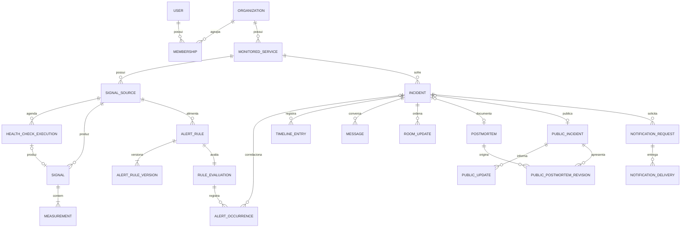
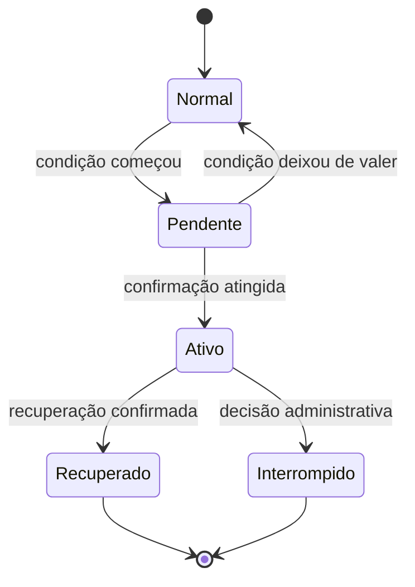
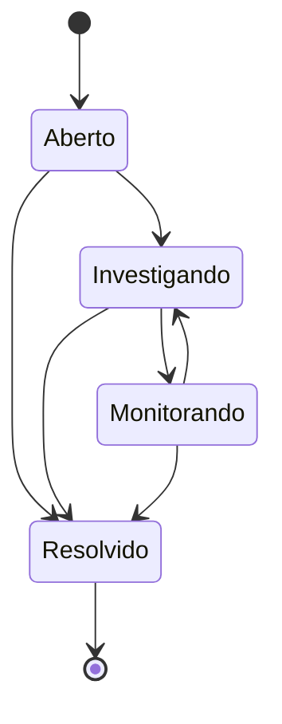

# Modelo conceitual do IncidentLab

Status: proposta para revisão

Este documento descreve os conceitos, relações e fronteiras de consistência do IncidentLab. Ele complementa o [system design](./system-design.md), usa o [vocabulário do domínio](../../CONTEXT.md) e não define tabelas, APIs, classes nem tecnologias.

## Como ler o modelojj

- **Entidade** possui identidade e ciclo de vida próprios.
- **Objeto de valor** descreve uma característica sem identidade própria.
- **Agregado** é a menor fronteira que precisa permanecer consistente em uma única operação.
- **Projeção** é uma visão derivada para consulta; ela não é a fonte da verdade dos conceitos que reúne.
- Relações entre áreas são referências por identidade ou cópias históricas, não permissão para uma área alterar dados da outra.

## Visão geral



As quatro áreas continuam proprietárias de seus próprios dados:

| Área | Conceitos próprios |
| --- | --- |
| Organizações | Organização, usuário e vínculo organizacional |
| Monitoramento | Serviço, fonte, sinal, medição, regra, avaliação e ocorrência de alerta |
| Resposta a Incidentes | Incidente, timeline, conversa, sequência da sala e postmortem |
| Comunicação | Incidente público, atualização pública e entrega de notificação |

## Organizações

### Organização

É o limite de isolamento entre clientes do sistema.

- Todo serviço, incidente e dado operacional pertence a exatamente uma organização.
- Uma relação entre entidades de organizações diferentes é sempre inválida.
- Excluir ou remover um vínculo não apaga autoria histórica.

### Usuário e vínculo organizacional

O **usuário** representa a identidade da pessoa. O **vínculo organizacional** associa essa pessoa a uma organização e contém seu papel fixo: `admin`, `respondente` ou `visualizador`.

A permissão vem do vínculo, enquanto a responsabilidade principal por um incidente é uma atribuição operacional. Portanto, ser responsável não concede permissões adicionais e remover um vínculo revoga o acesso mesmo que a pessoa ainda apareça no histórico.

Identidade conceitual do vínculo: `organização + usuário`.

## Monitoramento

### Serviço monitorado

Representa o sistema ou componente cuja saúde é acompanhada.

- Pertence a uma organização.
- Possui fontes de sinais.
- Pode ser arquivado.
- Só pode ser excluído quando não possui histórico operacional; caso contrário, é preservado e arquivado.
- Seu estado operacional atual é uma projeção derivada, não um valor editado diretamente.

### Fonte de sinais

Define de onde vêm observações sobre um serviço: coleta feita pelo IncidentLab ou envio externo.

- Pertence a exatamente um serviço.
- Autentica e identifica sinais em seu próprio escopo.
- Alimenta regras que avaliam métricas produzidas por ela.

### Execução de health check

Representa uma tentativa agendada de observar um alvo. Cada horário produz no máximo uma tentativa e não há repetição imediata no MVP; confirmações consecutivas pertencem às regras de alerta.

| Resultado | Significado | Efeito sobre o serviço |
| --- | --- | --- |
| Saudável | O alvo respondeu conforme o esperado | Produz disponibilidade saudável e latência |
| Falha observada do alvo | A tentativa ocorreu, mas não obteve a resposta esperada | Produz disponibilidade indisponível e o motivo |
| Lacuna de monitoramento | O IncidentLab não conseguiu executar uma tentativa confiável | Não produz falha do alvo; reduz cobertura e pode levar a desconhecido |

Motivos de falha observada do alvo no MVP:

- `name_resolution_failed`: o endereço do alvo não foi resolvido durante a tentativa;
- `connection_failed`: a conexão foi recusada, encerrada ou falhou;
- `connection_timeout`: a conexão não foi estabelecida dentro do limite;
- `secure_connection_failed`: certificado ou negociação do canal seguro falhou;
- `response_timeout`: a conexão ocorreu, mas a resposta não chegou no limite;
- `unexpected_status`: a resposta apresentou estado diferente do esperado;
- `content_mismatch`: o conteúdo esperado não foi encontrado.

Motivos de lacuna de monitoramento no MVP:

- `executor_unavailable`: o executor não estava disponível;
- `internal_error`: uma falha interna impediu a tentativa confiável;
- `overlap_skipped`: a execução anterior ainda estava ativa;
- `shutdown_cancelled`: o encerramento do IncidentLab cancelou a tentativa.

Uma resposta lenta dentro do limite continua saudável para disponibilidade e preserva sua latência, que pode ativar uma regra própria. Falhas de resolução de nome ou canal seguro são atribuídas ao alvo quando pertencem à tentativa específica; uma falha diagnosticada na infraestrutura comum do IncidentLab pertence ao monitoramento.

### Sinal e medição

O **sinal** é um fato imutável observado em um instante. Cada sinal contém uma ou mais **medições** tipadas.

- A identidade externa é `fonte + identificador da origem`.
- O sinal e todas as suas medições são aceitos ou rejeitados juntos.
- Reenvios da mesma identidade retornam o resultado já conhecido e não repetem efeitos.
- O instante da observação e o instante de recebimento são preservados separadamente.
- Sinais atrasados permanecem auditáveis, mas não reescrevem o estado operacional atual.
- O dado bruto tem retenção limitada; evidências copiadas para alertas permanecem.

#### Semântica temporal

- Uma fonte com frequência esperada recebe frescor padrão igual a três vezes essa frequência, configurável por fonte.
- Um sinal ainda mais novo que o ponto da avaliação só participa do estado atual se estiver fresco quando for aceito.
- Um sinal anterior ao ponto já avaliado é marcado como atrasado, sem janela de espera para reordenamento.
- Um instante observado até um minuto no futuro é tolerado, mas seu instante efetivo de avaliação é limitado ao instante recebido.
- Um instante observado mais de um minuto no futuro é inválido e faz o sinal inteiro ser rejeitado.
- A elegibilidade é fixada na aceitação durável: atraso posterior nos processadores internos não torna a evidência retroativamente inválida.

Fontes sem frequência esperada não recebem um frescor padrão e não podem sustentar regras baseadas em silêncio ou duração até que esse contrato temporal seja definido.

### Regra e versão da regra

A **regra de alerta** liga uma fonte e uma métrica a condições de ativação e recuperação. Sua configuração mutável é representada por versões imutáveis.

- Cada regra avalia exatamente uma métrica de uma fonte.
- Uma versão guarda as condições completas necessárias para reproduzir a decisão.
- Editar uma regra cria outra versão; não altera versões anteriores.
- Uma ocorrência ativa continua usando a versão que a originou.
- Se uma edição ocorrer durante uma pendência, a pendência é reiniciada com a nova versão.

Identidade conceitual da versão: `regra + número da versão`.

As condições disponíveis no MVP seguem a semântica de cada métrica:

| Métrica | Condição de ativação | Condição de recuperação |
| --- | --- | --- |
| Disponibilidade | Está indisponível | Está saudável |
| Latência | Está no limite ou acima | Está abaixo do limite de recuperação |
| Taxa de erros | Está no limite ou acima, respeitando eventual amostra mínima | Está abaixo do limite de recuperação, respeitando eventual amostra mínima |
| Heartbeat | Nenhuma evidência válida durante o período configurado | Evidência válida voltou a chegar |

Quando aplicável, ativação e recuperação escolhem confirmação por quantidade consecutiva ou por duração, nunca as duas simultaneamente. Os limites de ativação e recuperação são independentes para evitar alternância perto do mesmo valor. O MVP não oferece igualdade numérica, fórmulas, operadores lógicos nem composição entre métricas; essas capacidades poderão ser adicionadas quando houver casos concretos.

### Avaliação da regra e ocorrência de alerta

A **avaliação da regra** representa a máquina de estado corrente de uma regra. A **ocorrência de alerta** registra uma passagem concreta por essa máquina.



- Existe uma avaliação corrente por regra.
- A avaliação é serializada por `serviço + regra`.
- `normal` significa que não há ocorrência em andamento.
- Se a condição deixa de valer, a pendência se encerra sem ativação e a avaliação volta a `normal`.
- Uma ocorrência ativa termina somente como recuperada ou interrompida.
- Falta de dados pode cancelar uma pendência, mas não prova recuperação de um alerta ativo.
- A ocorrência preserva a versão da regra e um recorte das evidências que justificaram suas transições.

A avaliação corrente e sua ocorrência em andamento formam uma única fronteira de consistência: não pode existir transição da avaliação sem o registro correspondente da ocorrência.

### Estado operacional do serviço

O estado atual é uma projeção calculada a partir de alertas ativos e impactos declarados por incidentes manuais:

```text
indisponível > degradado > desconhecido > operacional
```

Ele não pertence ao ciclo de vida do incidente e não deve ser usado como sinônimo de severidade.

## Resposta a Incidentes

### Incidente

É o agregado que governa a resposta humana a um problema em um serviço.

Possui:

- organização e serviço;
- origem manual ou automática;
- estado, severidade e versão concorrente;
- no máximo um responsável principal;
- impacto operacional declarado, quando manual;
- resultado e nota de resolução, quando resolvido;
- referência ao incidente principal, quando marcado como duplicado;
- referência à regra e à versão de origem, quando automático.



Invariantes:

- Cada incidente pertence a exatamente um serviço.
- `resolvido` é terminal e exige resultado, nota, autoria e instante.
- Um incidente pode ser resolvido enquanto o alerta de origem continua ativo.
- Uma recuperação posterior pode entrar na timeline, mas não reabre o incidente.
- Existe no máximo um incidente automático não resolvido por `serviço + regra`.
- Reativações antes da resolução são anexadas ao incidente automático existente.
- Incidentes manuais nunca são reutilizados automaticamente.
- Incidentes duplicados continuam independentes; timeline e conversa não são mescladas.

### Responsabilidade principal

O incidente pode começar sem responsável. Um `respondente` ou `admin` pode assumir um incidente sem responsável; o responsável atual pode transferi-lo, e um `admin` pode substituir a atribuição.

A troca usa a versão observada do incidente. Duas pessoas não conseguem assumir com sucesso a mesma versão.

### Colaboração sem lista de participantes

O MVP não possui uma entidade persistente de participante do incidente. Abrir ou observar a sala não cria vínculo com o incidente.

- O responsável principal representa quem coordena a resposta.
- A autoria de mensagens e ações preserva quem efetivamente colaborou.
- A presença efêmera mostra somente quem está conectado naquele momento.
- Nenhum desses conceitos altera o papel ou as permissões do vínculo organizacional.

Uma participação explícita só será adicionada se passar a sustentar um comportamento próprio, como notificações direcionadas, atribuições múltiplas ou métricas de colaboração.

### Timeline, conversa e sequência da sala

Esses registros são relacionados ao incidente, mas não integram uma coleção que precise ser carregada inteira para alterar seu estado.

- **Entrada da timeline**: fato oficial, cronológico e imutável.
- **Mensagem**: conteúdo livre e imutável da conversa.
- **Atualização da sala**: posição monotônica que ordena tudo que os clientes precisam receber.

Promover uma mensagem cria uma entrada de timeline que copia seu conteúdo e autoria naquele instante. Remover visualmente uma mensagem exige ação administrativa auditada; o registro histórico não é reescrito silenciosamente.

Uma mudança do incidente confirma, na mesma operação, o novo estado, a nova versão, sua entrada de timeline, a atualização da sala e a obrigação de divulgar o fato. Enviar uma mensagem confirma a mensagem e a atualização da sala juntas, sem disputar a versão do incidente.

#### Encerramento da conversa

- Resolver o incidente inicia uma janela de sete dias para esclarecimentos posteriores.
- Durante a janela, `respondentes` e `admins` podem enviar mensagens e promover mensagens para a timeline.
- Essas ações não reabrem, não alteram o estado e não geram notificações gerais do incidente.
- Depois da janela, a conversa fica somente para leitura e promoções também são recusadas.
- Não existe reabertura da conversa nem exceção administrativa no MVP.
- Entradas automáticas tardias continuam permitidas na timeline.
- O postmortem permanece editável de acordo com seu próprio ciclo.

O encerramento da escrita é derivado do instante de resolução e não adiciona um estado ao ciclo do incidente.

### Postmortem

É um agregado próprio vinculado a no máximo um incidente. Ele permanece editável sem reabrir nem alterar o incidente resolvido.

- É opcional para severidades baixa e média.
- Fica pendente após resolver incidentes de severidade alta ou crítica.
- Segue o fluxo `pendente → rascunho → concluído`.
- Para severidades baixa e média, sua criação opcional começa como rascunho.
- Um `respondente` ou `admin` pode editar e concluir.
- Contém resumo, impacto, causa conhecida ou não determinada, solução ou mitigação, aprendizados e ações preventivas.
- A timeline serve como referência e não é copiada integralmente.
- Editar um postmortem concluído o devolve a rascunho e registra a alteração.
- Ações preventivas são itens textuais no MVP, sem responsáveis, prazos ou fluxo de tarefas.

Concluir um postmortem não publica conteúdo nem modifica o incidente.

## Comunicação

### Incidente público e atualização pública

O **incidente público** é uma publicação segura derivada de um incidente interno. Ele não expõe automaticamente título, mensagens, timeline ou dados técnicos internos.

- Um incidente interno pode não possuir publicação.
- A publicação tem ciclo de vida próprio e conteúdo deliberadamente público.
- Atualizações públicas são anexadas ao incidente público.
- O status público do serviço é uma projeção, não acesso direto ao estado interno.

Para um incidente já público, um postmortem concluído pode originar um **resumo público pós-incidente**. O sistema prepara conteúdo seguro, um `respondente` ou `admin` revisa a prévia e confirma a publicação em uma única ação.

- O resumo público é uma cópia independente, não uma visualização direta do postmortem.
- Conversa, nomes de respondentes, evidências técnicas, hipóteses descartadas e referências internas não são copiados automaticamente.
- Alterar o postmortem não modifica versões públicas existentes.
- Uma correção exige nova revisão e nova publicação explícita.
- Não há aprovação em múltiplas etapas nem publicação programada no MVP.

### Solicitação e entrega de notificação

Uma **solicitação de notificação** registra que uma mudança relevante precisa ser comunicada. Cada combinação de destinatário e canal resulta em uma **entrega de notificação** independente; tentativas repetidas pertencem à mesma entrega.

- A política considera a severidade vigente quando a solicitação é criada.
- `low` e `medium` geram notificações internas para `respondentes` e `admins`.
- `high` e `critical` também geram e-mail para os membros elegíveis.
- A organização pode tornar e-mails `critical` obrigatórios; os demais e-mails respeitam a preferência pessoal.
- Abertura, escalada relevante, atribuição direta e resolução são os gatilhos do MVP.
- A atribuição ou transferência notifica somente a pessoa diretamente envolvida.
- A resolução considera os destinatários das comunicações anteriores de abertura ou escalada.
- Mensagens e transições rotineiras entre investigação e monitoramento não geram avisos gerais.
- Falha em um destinatário ou canal não desfaz o incidente nem bloqueia os demais.
- Cada entrega percorre `pendente`, `entregue`, `falha permanente` ou `cancelada`.
- Uma falha temporária mantém a entrega pendente para outra tentativa com a mesma identidade.
- A elegibilidade do membro é conferida novamente antes do envio externo; sua perda cancela a entrega.
- E-mails contêm apenas serviço, severidade, estado, resumo seguro e referência para acesso autenticado.
- Tempo real apenas distribui atualizações da sala e não substitui a notificação interna persistente.

SMS, push, integrações com chat corporativo e webhooks ficam fora do MVP, sem impedir novos tipos de canal no futuro.

## Objetos de valor principais

| Objeto | Significado |
| --- | --- |
| Papel | `admin`, `respondente` ou `visualizador` dentro de uma organização |
| Severidade | Impacto conhecido do incidente, independente de seu estado |
| Estado operacional | Saúde derivada do serviço |
| Impacto declarado | Contribuição manual ao estado operacional |
| Resultado da resolução | `mitigado`, `recuperado`, `falso_positivo` ou `duplicado` |
| Condição de alerta | Métrica, operador, limiar e confirmação por contagem ou duração |
| Condição de recuperação | Critério independente que encerra uma ocorrência ativa |
| Instantes da observação | Instante em que o fato ocorreu e instante em que foi recebido |
| Referência de autoria | Identidade histórica suficiente para preservar quem realizou uma ação |
| Correlação | Identidades que ligam comando, acontecimento causador e fluxo operacional |

## Fronteiras de consistência

| Operação | O que precisa ser atômico |
| --- | --- |
| Criar organização | Organização e vínculo inicial de `admin` |
| Aceitar sinal | Sinal, medições e obrigação durável de processá-lo |
| Avaliar regra | Estado da avaliação, ocorrência, evidências e acontecimento resultante |
| Alterar incidente | Estado, versão, timeline, sequência da sala e obrigação de divulgação |
| Enviar mensagem | Mensagem e sequência da sala |
| Publicar atualização | Estado público, atualização pública e obrigação de divulgação |

Uma transação não atravessa áreas. Por exemplo, ao remover um membro, Organizações revoga o acesso e publica `MembroRemovido`; Resposta a Incidentes libera de forma idempotente os incidentes sob responsabilidade dessa pessoa e registra o fato. A revogação não espera essa limpeza para ser efetiva.

## Identidades e unicidades

| Conceito | Regra conceitual |
| --- | --- |
| Vínculo organizacional | Um por `organização + usuário` |
| Sinal externo | Um por `fonte + identificador da origem` |
| Versão de regra | Uma por `regra + número da versão` |
| Avaliação corrente | Uma por regra |
| Incidente automático não resolvido | No máximo um por `serviço + regra` |
| Atualização da sala | Uma posição por `incidente + sequência` |
| Comando do cliente | Um efeito por `escopo do emissor + identificador do comando` |
| Consumo de acontecimento | Um efeito por `consumidor + identificador do acontecimento` |

Essas regras expressam intenção de domínio. A implementação física pode usar estruturas diferentes desde que preserve o comportamento.

## Referências e cópias históricas

- Uma área guarda a identidade de conceitos de outra, sem alterá-los diretamente.
- Dados que precisam continuar explicáveis são copiados no momento da decisão: versão da regra, evidências do alerta, severidade usada para notificar e referência de autoria.
- Alterações futuras na origem não reescrevem essas cópias.
- Visões combinadas podem consultar várias áreas e aceitar atraso eventual; comandos sempre são decididos pelo agregado proprietário.

## Repetição e isolamento

Falhas temporárias em acontecimentos internos e e-mails usam seis tentativas totais com a mesma identidade:

| Execução | Agendamento |
| --- | ---: |
| Tentativa inicial | Quando o trabalho se torna devido |
| Repetição 1 | 1 minuto |
| Repetição 2 | 5 minutos |
| Repetição 3 | 15 minutos |
| Repetição 4 | 60 minutos |
| Repetição 5 | 360 minutos |

- Acontecimentos internos que esgotam as tentativas são isolados e permanecem preservados.
- O isolamento pausa acontecimentos posteriores da mesma entidade para não quebrar sua ordem; outras entidades continuam.
- Depois da correção, o acontecimento isolado é reenviado com a mesma identidade.
- E-mails que esgotam as tentativas terminam como falha permanente, sem afetar incidente, notificação interna ou outros destinatários.
- Uma falha interna reconhecidamente não repetível é isolada imediatamente.
- Destinatário inelegível cancela a entrega; endereço ou recusa definitivamente inválidos causam falha permanente imediata.
- Uma confirmação perdida do provedor pode causar e-mail duplicado; o MVP não promete entrega externa exatamente uma vez.
- Health checks, sinais recusados e comandos reenviados pelo cliente não usam essa política.

## Retenção e temporalidade

- Presença na sala é efêmera e não faz parte do modelo persistente.

| Informação | Retenção inicial |
| --- | --- |
| Sinal bruto | 30 dias após a aceitação |
| Identidade de idempotência de sinal ou comando | 30 dias após a aceitação |
| Mensagem da conversa | 180 dias após a resolução do incidente |
| Notificação interna | 90 dias após a criação |
| Detalhes técnicos de uma entrega | 30 dias após seu resultado terminal |
| Acontecimento processado entre áreas | 7 dias após o processamento |
| Acontecimento isolado por falha | Até ser resolvido e por mais 7 dias |
| Auditoria administrativa | 2 anos após a ação |
| Incidente, timeline e resultado | Sem remoção automática no MVP |
| Alerta e evidências preservadas | Sem remoção automática no MVP |
| Versão de regra utilizada | Sem remoção automática no MVP |
| Postmortem e conteúdo público | Sem remoção automática no MVP |

Regras complementares:

- O prazo da conversa não começa enquanto o incidente não for resolvido.
- Ao expirar uma mensagem, seu conteúdo é removido e uma indicação mínima de retenção pode permanecer.
- Uma mensagem promovida continua na timeline porque sua nota oficial é uma cópia independente.
- Alertas mantêm evidências suficientes mesmo depois da expiração do sinal bruto.
- Depois de 30 dias, repetir um identificador antigo não possui garantia de retornar o resultado original.
- Um acontecimento isolado nunca expira enquanto ainda impedir o processamento ordenado de sua entidade.
- Retenção configurável por organização fica fora do MVP.
- Exclusões exigidas por obrigação legal ou decisão administrativa excepcional seguem processo separado e auditado.

## Limites operacionais do MVP

| Fluxo | Limite |
| --- | ---: |
| Intervalo de health check | Mínimo de 30 segundos |
| Ingestão externa por fonte | 120 sinais por minuto |
| Ingestão externa por organização | 1.000 sinais por minuto |

- Não há quantidade máxima de membros, serviços, fontes, regras, incidentes ou registros históricos por organização.
- Um sinal que excede o limite é recusado antes da aceitação durável e pode ser reenviado com a mesma identidade.
- Todo sinal já aceito continua obrigado a ser processado.
- Alertas e obrigações de criar incidentes nunca são descartados por limite de capacidade.
- Health checks usam agendamento justo entre organizações e backpressure interno; atraso excessivo torna-se lacuna de monitoramento visível.
- Os limites são fixos e iguais para as organizações no MVP.
- Cotas personalizadas e planos comerciais ficam fora do MVP.

## Cenários de validação do modelo

### Reenvio do mesmo sinal

A fonte reenvia a mesma identidade. O sistema encontra o sinal existente, não cria novas medições e não repete a avaliação como um novo fato.

### Duas pessoas assumem o incidente

Ambas leem a mesma versão. A primeira operação confirmada altera o responsável e avança a versão; a segunda é recusada por estar baseada em estado antigo.

### Incidente resolvido antes da recuperação

O incidente permanece resolvido. O alerta continua ativo e ainda afeta o estado operacional. Quando a recuperação chega, ela encerra o alerta e gera uma entrada automática na timeline, sem reabrir o incidente.

### Membro removido durante a resposta

O acesso é revogado em Organizações. A reação durável em Resposta a Incidentes remove sua responsabilidade principal, preserva sua autoria anterior e informa a sala.

## Estado da revisão

As decisões conceituais e os valores operacionais inicialmente abertos neste modelo foram resolvidos.
