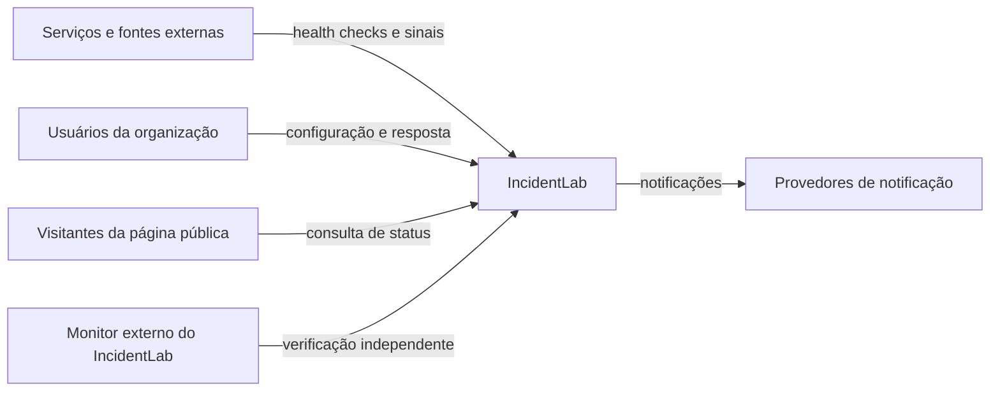
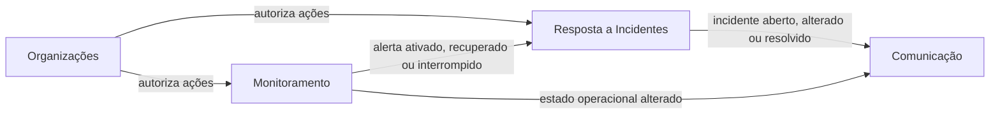
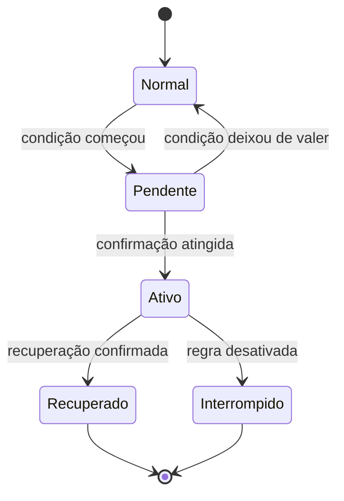
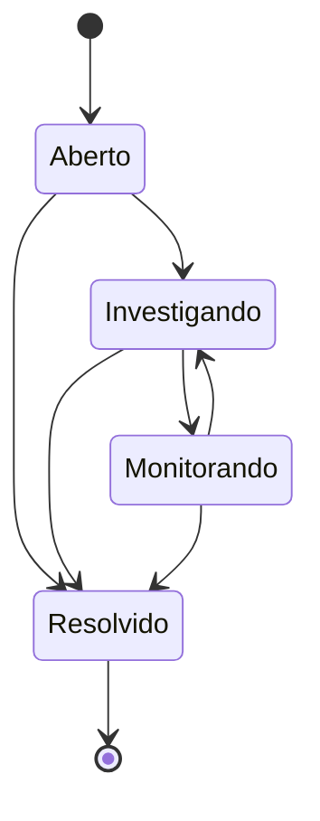
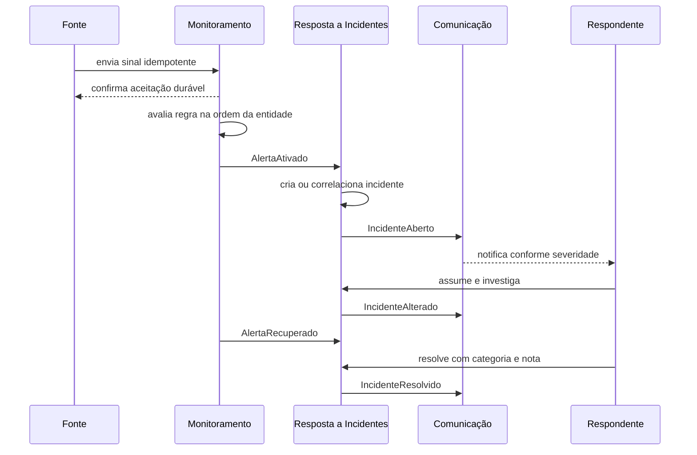

# System design do IncidentLab

Este documento consolida a arquitetura conceitual do IncidentLab sem escolher tecnologias. O [modelo conceitual](./domain-model.md) detalha entidades e fronteiras de consistência, o [vocabulário do domínio](../../CONTEXT.md) define os termos canônicos, o [MVP](../requirements/mvp.md) transforma o desenho em casos verificáveis e o [índice de ADRs](../adr/README.md) preserva as decisões e suas justificativas.

## Objetivo e recorte

O IncidentLab observa sintomas em serviços, confirma condições por regras, abre incidentes e sustenta a resposta humana até a resolução. O fluxo central do MVP é:

```text
sinal → avaliação → alerta ativo → incidente → resposta → recuperação → resolução
```

O produto detecta sintomas operacionais; ele não diagnostica bugs nem infere automaticamente a causa raiz.

## Princípios

- O estado persistido é a fonte da verdade.
- Sinal, alerta e incidente são conceitos distintos.
- Cada área escreve somente nos dados que controla.
- Reações assíncronas podem atrasar, mas não desfazem fatos confirmados.
- Entregas podem se repetir; os efeitos precisam ser idempotentes.
- Ordem é garantida por entidade, não globalmente.
- Tempo real melhora a experiência, mas não é necessário para operar.
- Timeline e acontecimentos não tornam o sistema event-sourced.
- O MVP evita correlação heurística, propagação entre dependências e métricas arbitrárias.

## Contexto



## Áreas e propriedade

| Área | Controla | Não controla |
| --- | --- | --- |
| Organizações | Usuários, vínculos, papéis e permissões | Serviços, alertas e incidentes |
| Monitoramento | Serviços, fontes, sinais, medições, regras, alertas e estado operacional | Ciclo de vida da resposta humana |
| Resposta a Incidentes | Incidentes, responsabilidade, severidade, conversa, timeline e postmortem | Avaliação das regras e publicação externa |
| Comunicação | Notificações, publicações e estado público | Estado interno de monitoramento e do incidente |

Tempo real, aceitação durável, processamento assíncrono, idempotência e observabilidade são capacidades transversais. Elas não formam novas áreas de domínio.



## Modelo conceitual

O [modelo conceitual detalhado](./domain-model.md) define as entidades, objetos de valor, agregados, identidades e operações atômicas. As regras estruturais centrais são:

- Toda entidade operacional pertence a exatamente uma organização.
- Cada serviço possui fontes; cada regra avalia uma métrica de uma fonte.
- Um sinal pode carregar várias medições e é aceito ou rejeitado por inteiro.
- Cada incidente pertence a exatamente um serviço.
- Incidentes automáticos preservam a regra e sua versão de origem.
- Conversa e timeline são registros diferentes.
- A publicação externa é uma projeção segura, nunca exposição do incidente interno.

## Ciclos de vida

### Avaliação e alerta

`normal` é o estado da avaliação quando não existe uma ocorrência de alerta em andamento.



- A ativação e a recuperação possuem condições independentes por contagem ou duração.
- Uma condição temporal exige evidências ao longo da janela; uma medição isolada não é prolongada indefinidamente.
- Falta de sinais cancela uma pendência quando a evidência perde validade, mas não recupera um alerta ativo.
- Um alerta ativo continua usando a versão de regra que o originou. Uma edição só passa a valer na avaliação seguinte, sem versões paralelas.
- Um alerta ativo termina somente como recuperado ou interrompido.

### Tempo e frescor dos sinais

- Instante observado e instante recebido são preservados separadamente.
- O frescor padrão é três vezes a frequência esperada e pode ser configurado por fonte.
- Não há espera para reordenamento: sinais anteriores ao ponto avaliado são armazenados como atrasados e não alteram o estado atual.
- Instantes até um minuto no futuro são tolerados, mas limitados ao instante recebido para avaliação; desvios maiores são rejeitados.
- A validade é determinada na aceitação; atraso interno posterior não invalida um sinal que era elegível.
- Fontes sem frequência esperada não sustentam regras baseadas em silêncio ou duração.

### Incidente



- `resolvido` é terminal; uma recorrência posterior abre outro incidente.
- O estado terminal impede novas transições, mas não impede entradas automáticas posteriores na timeline, como a recuperação tardia do alerta de origem.
- Nenhum estado intermediário é obrigatório.
- Resolver exige categoria, nota, autoria e instante.
- Categorias: `mitigado`, `recuperado`, `falso_positivo` e `duplicado`.
- O incidente pode ser resolvido enquanto o alerta permanece ativo, com aviso e auditoria; a mesma ativação não cria outro incidente.
- Um incidente possui no máximo um responsável principal e pode começar sem responsável.

### Estado operacional do serviço

O estado é derivado de alertas ativos e de impactos declarados por incidentes manuais:

```text
indisponível > degradado > desconhecido > operacional
```

- Alertas pendentes não alteram o estado.
- Falha conhecida prevalece sobre falta de dados.
- O estado só é operacional sem impacto ativo nem falta de dados necessários.
- Dependências são informativas e não propagam estado no MVP.
- Estado operacional e severidade do incidente são independentes.

## Fluxo automático principal



Garantias do fluxo:

- A confirmação do sinal ocorre somente depois de sua aceitação durável.
- A identidade idempotente do sinal é `fonte + identificador da origem`.
- Uma combinação `serviço + regra` possui no máximo um incidente automático ativo.
- Reativações antes da resolução entram no incidente existente.
- Um incidente manual nunca é reutilizado automaticamente.
- Depois de uma ativação elegível, criar o incidente é uma obrigação durável, mesmo que o alerta se recupere durante um atraso interno.

## Fluxo manual

Ao abrir um incidente manual, um `respondente` ou `admin` escolhe serviço, severidade e impacto operacional declarado. O incidente começa privado, sem responsável obrigatório, e pode ser publicado explicitamente. Seu impacto deixa de contribuir para o estado do serviço quando o incidente é resolvido.

Um incidente manual e um automático do mesmo serviço permanecem independentes. Se dois incidentes representarem o mesmo problema, um pode ser resolvido como duplicado e referenciar o principal; timelines e conversas nunca são mescladas.

## Consistência e concorrência

- Mudanças de estado do incidente usam a versão observada pelo autor; comandos baseados em versão antiga são recusados.
- Operações aditivas independentes, como mensagens, não disputam a versão do incidente.
- Estado, nova versão, timeline e obrigação de divulgação são confirmados juntos.
- Cada operação confirmada ocupa uma posição na sequência da sala; estado e timeline gerados pela mesma operação formam uma única atualização.
- Comandos do cliente possuem identidade idempotente.
- A avaliação é sequencial por `serviço + regra` e paralela entre combinações independentes.
- Acontecimentos entre áreas têm entrega pelo menos uma vez e consumidores idempotentes.
- A ordem é preservada por entidade. Uma falha isolada pausa apenas a entidade afetada até intervenção.

## Comandos principais

Comandos expressam intenções e podem ser recusados.

| Área | Comandos |
| --- | --- |
| Organizações | Alterar papel, remover membro |
| Monitoramento | Cadastrar ou arquivar serviço, configurar fonte, criar ou editar regra, desativar regra, aceitar sinal |
| Resposta a Incidentes | Abrir incidente manual, assumir, transferir responsabilidade, alterar estado, severidade ou impacto, enviar mensagem, promover mensagem, marcar duplicado, resolver, preencher postmortem |
| Comunicação | Configurar publicação, publicar incidente manual, publicar atualização, encerrar publicação excepcional |

Regras de autorização:

- `admin`: administra organização, serviços e regras e também responde a incidentes.
- `respondente`: opera incidentes.
- `visualizador`: consulta sem alterar.
- O papel pertence ao vínculo do usuário com a organização.
- Responsabilidade principal é uma atribuição operacional, não um papel de acesso.

## Acontecimentos entre áreas

Acontecimentos expressam fatos passados e não podem ser recusados pelo produtor depois de confirmados.

| Produtor | Acontecimento | Consumidor principal |
| --- | --- | --- |
| Organizações | MembroRemovido | Resposta a Incidentes, tempo real |
| Monitoramento | AlertaAtivado | Resposta a Incidentes |
| Monitoramento | AlertaRecuperado | Resposta a Incidentes |
| Monitoramento | AlertaInterrompido | Resposta a Incidentes |
| Monitoramento | EstadoOperacionalAlterado | Visões de leitura, Comunicação |
| Resposta a Incidentes | IncidenteAberto | Comunicação, tempo real |
| Resposta a Incidentes | IncidenteAlterado | Comunicação, tempo real |
| Resposta a Incidentes | IncidenteResolvido | Comunicação, tempo real |
| Comunicação | PublicaçãoAlterada | Página pública |

Todo comando e acontecimento possui identidade; fluxos propagam causa imediata e correlação comum.

## Colaboração e retomada

- Conversa é livre; timeline contém fatos operacionais e notas promovidas.
- Mensagens e timeline são imutáveis; correções e moderações geram novos registros auditáveis.
- Promover uma mensagem copia seu conteúdo para uma nota independente na timeline.
- O MVP não mantém uma lista persistente de participantes; coordenação, autoria e presença permanecem conceitos distintos.
- Resolver o incidente mantém mensagens e promoções abertas por sete dias; depois disso, a conversa fica somente para leitura.
- A janela posterior não reabre o incidente, e não existe reabertura da conversa no MVP.
- Postmortem e entradas automáticas tardias da timeline continuam independentes do encerramento da conversa.
- Presença é efêmera e não participa da sequência nem da auditoria.
- Ao reconectar, o cliente informa a última sequência recebida e recupera as posteriores.
- Se o intervalo não estiver disponível, o cliente recarrega o estado oficial completo.
- Sem canal em tempo real, comandos persistidos continuam e a interface usa atualização manual ou periódica.

## Comunicação externa

### Notificações

- Notificações nunca bloqueiam nem desfazem o incidente.
- `low` e `medium` notificam internamente `respondentes` e `admins`; `high` e `critical` também usam e-mail.
- Abertura, escalada relevante e resolução notificam a audiência aplicável; atribuição notifica somente a pessoa envolvida.
- Mensagens e transições rotineiras não geram avisos gerais.
- A caixa interna é persistente; tempo real apenas antecipa sua apresentação.
- E-mails não críticos respeitam a preferência pessoal, enquanto a organização pode tornar os críticos obrigatórios.
- Entrega não atribui responsabilidade.
- Entregas são independentes por destinatário e canal; falhas temporárias são repetidas com a mesma identidade e falhas permanentes ficam visíveis.
- A perda de elegibilidade do destinatário antes do e-mail cancela a entrega.
- SMS, push, chat corporativo e webhooks ficam fora do MVP.

### Página de status

- Organização escolhe serviços públicos; regra escolhe publicação automática.
- Incidente automático elegível é publicado desde a abertura com texto seguro e cauteloso.
- Transições internas geram mensagens públicas genéricas, sem expor conversa, responsável, suspeitas ou timeline.
- Incidente manual começa privado.
- Se o incidente for resolvido com alerta ainda ativo, a publicação exige uma escolha humana e nunca afirma recuperação automaticamente.
- Estado e histórico públicos consideram apenas impactos publicados; podem divergir intencionalmente da visão interna.

### Postmortem e resumo público

- O postmortem interno segue `pendente`, `rascunho` e `concluído` sem alterar o incidente resolvido.
- `high` e `critical` criam pendência automática; `low` e `medium` permitem rascunho opcional.
- O documento registra resumo, impacto, causa conhecida ou não determinada, solução ou mitigação, aprendizados e ações preventivas.
- Editar um postmortem concluído o devolve a rascunho com auditoria.
- Somente incidentes já públicos podem receber resumo público pós-incidente no MVP.
- Um `respondente` ou `admin` revisa uma cópia segura e publica com uma única confirmação.
- Mudanças internas posteriores nunca alteram automaticamente o conteúdo publicado.
- Não há aprovação em múltiplas etapas, publicação programada nem gestão de tarefas preventivas no MVP.

## Histórico e métricas

- Sinais brutos: retenção inicial de 30 dias.
- Mensagens: 180 dias após a resolução; notas promovidas permanecem na timeline.
- Notificações internas: 90 dias; detalhes técnicos de entrega: 30 dias após o resultado.
- Identidades de idempotência: 30 dias.
- Acontecimentos processados: 7 dias; itens isolados permanecem até a resolução e por mais 7 dias.
- Auditoria administrativa: 2 anos.
- Incidentes, timelines, alertas e evidências preservadas, versões usadas, postmortems e conteúdo público não têm remoção automática no MVP.
- Alertas: preservam regra, evidências de ativação e recuperação e resumo da avaliação.
- Incidentes, timelines e postmortems não dependem dos sinais brutos.
- Sinais repetitivos de um alerta ativo não poluem a timeline.
- Disponibilidade e cobertura do monitoramento são métricas separadas.
- Estado `desconhecido` não conta como disponibilidade nem indisponibilidade.
- Tempos medidos separadamente: detecção, recuperação técnica e resolução operacional.
- Incidentes `high` e `critical` geram pendência de postmortem sem bloquear a resolução.

## Métricas aceitas no MVP

| Medição | Semântica |
| --- | --- |
| `availability` | Estado saudável ou indisponível |
| `latency` de health check | Duração daquela tentativa em milissegundos |
| `latency` externa | Percentil 95 no período, com janela e tamanho da amostra |
| `error_rate` | Proporção entre zero e um, com janela e tamanho da amostra |
| `heartbeat` | Evidência de atividade da fonte |

Cada regra avalia uma métrica de uma fonte. Métricas arbitrárias e combinações entre fontes ficam fora do MVP.

As condições também são limitadas pela métrica: disponibilidade compara saudável e indisponível; latência e taxa de erros ativam no limite ou acima e recuperam abaixo de um limite independente; heartbeat ativa por ausência e recupera quando a evidência válida retorna. Quando aplicável, ativação e recuperação usam contagem consecutiva ou duração. Fórmulas, operadores lógicos e composição entre métricas ficam fora do MVP, mas poderão ser introduzidos futuramente sem alterar o significado das versões existentes.

## Degradação e falhas

| Falha | Comportamento |
| --- | --- |
| Canal em tempo real indisponível | Operação persiste; interface atualiza manual ou periodicamente; presença some |
| Processamento assíncrono indisponível | Entradas duráveis acumulam; avaliações, incidentes automáticos e notificações atrasam |
| Fonte da verdade indisponível | Escritas são recusadas; leituras antigas aparecem como desatualizadas |
| Provedor de notificação indisponível | Incidente continua; entrega é repetida ou marcada como falha permanente |
| Executor de health checks indisponível | Lacuna vira desconhecida; checks antigos não são reproduzidos |
| Evento interno falha repetidamente | Entidade é pausada e item isolado; demais entidades continuam |
| Cliente desconecta após enviar comando | Reenvia o mesmo identificador e recebe o resultado original |
| Sinal chega repetido | Primeira entrega prevalece; repetida idêntica não é reavaliada |
| Sinal chega atrasado | É preservado para auditoria, mas não reescreve o estado atual |

Um health check cujo alvo não responda é falha observada do serviço; incapacidade do IncidentLab de executar a tentativa é falha do monitoramento. O simulador usa os mesmos contratos públicos dos demais serviços. O automonitoramento cobre falhas parciais, enquanto uma queda total exige observação externa independente.

### Política de repetição

- Acontecimentos internos e e-mails fazem uma tentativa inicial e cinco repetições após 1, 5, 15, 60 e 360 minutos da primeira falha.
- Todas as execuções preservam a mesma identidade e podem ser processadas idempotentemente.
- Ao esgotar tentativas, acontecimentos internos são isolados e pausam apenas sua entidade; nunca são descartados.
- Ao esgotar tentativas, e-mails ficam como falha permanente sem afetar o incidente ou outros canais.
- Falhas internas reconhecidamente não repetíveis são isoladas imediatamente; falhas permanentes de e-mail encerram a entrega sem repetição.
- Falhas ambíguas do provedor podem produzir e-mail duplicado; não há promessa de entrega externa exatamente uma vez.
- Health checks, sinais recusados e comandos reenviados pelo cliente ficam fora dessa política.

### Resultados de health check

| Resultado | Motivos | Consequência |
| --- | --- | --- |
| Saudável | Resposta esperada dentro do limite | Disponibilidade saudável e medição de latência |
| Falha observada do alvo | Resolução de nome, conexão, canal seguro, tempo de resposta, status ou conteúdo inesperado | Disponibilidade indisponível com motivo |
| Lacuna de monitoramento | Executor indisponível, erro interno, sobreposição ou encerramento | Cobertura reduzida, sem atribuir falha ao alvo |

- Uma resposta lenta dentro do limite é saudável para disponibilidade e pode violar uma regra de latência.
- Falhas da tentativa específica pertencem ao alvo; falhas diagnosticadas na infraestrutura comum do IncidentLab pertencem ao monitoramento.
- Cada horário agendado produz no máximo uma tentativa, sem repetição imediata no MVP.

## Limites intencionais do MVP

- Uma aplicação organizada em áreas lógicas; nenhum microsserviço exigido.
- Um serviço por incidente.
- Uma fonte e uma métrica por regra.
- Um responsável principal por incidente.
- Papéis fixos: `admin`, `respondente` e `visualizador`.
- Sem event sourcing.
- Sem agrupamento ou propagação automática entre serviços.
- Sem quórum entre regiões ou fontes.
- Sem métricas personalizadas.
- Sem escalas de plantão ou escalonamento durável.
- Sem execução retroativa de health checks perdidos.
- Sem repetição imediata de uma tentativa de health check.

## Limites operacionais

| Fluxo | Limite do MVP |
| --- | ---: |
| Intervalo de health check | Mínimo de 30 segundos |
| Ingestão externa por fonte | 120 sinais por minuto |
| Ingestão externa por organização | 1.000 sinais por minuto |

- Membros, serviços, fontes, regras, incidentes e históricos não possuem cota quantitativa no MVP.
- Excesso de ingestão é recusado antes da aceitação durável; itens aceitos e suas consequências continuam garantidos.
- Agendamento justo e backpressure protegem health checks sem limitar cadastros; atrasos excessivos aparecem como lacunas de monitoramento.
- Os valores são iguais para todas as organizações e não representam planos comerciais.

## Resultado da revisão

A revisão não encontrou contradição estrutural que inviabilize o desenho. Foram reconciliadas quatro ambiguidades:

1. A identidade idempotente do sinal é escopada pela fonte, não apenas pelo serviço.
2. Uma ocorrência de alerta existe desde o estado pendente.
3. Uma regra editada não executa duas versões simultaneamente durante um alerta ativo.
4. Uma operação atômica do incidente ocupa uma única posição na sequência da sala.

Os ADRs permanecem como registro das escolhas. Este documento passa a ser a entrada principal para compreender como elas formam um sistema único.
